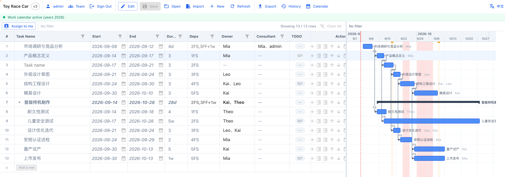
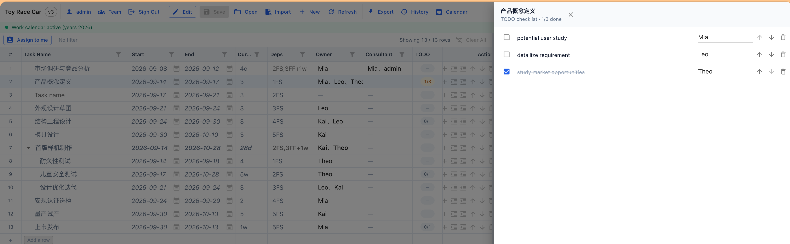

# Project Planning with Checklist

> 甘特图 + 任务验收清单 + 团队花名册 的轻量协作计划工具。

[](./LICENSE)

## 它是什么

一个**单页 Web App + Node 中心化服务**的项目计划工具。打开浏览器就能用，本地存储，零云依赖，零账号注册门槛（首次启动自动生成 admin）。

适合：

- 3–15 人的小团队做产品 / 硬件 / 软件项目排期
- 想要甘特图 + 任务清单，但不想被 Linear / Asana / MS Project 绑架
- 自托管数据敏感场景（数据全在你自己的机器上）

不适合：

- 100+ 人的复杂组织（请用专业 PPM）
- 需要实时协同编辑（这是单编辑者锁，不是 Figma 那种 CRDT）

## 5 分钟跑起来

### Mac

```bash
# 在项目根目录
./start.command
```

双击 `start.command` 也行（Finder 会自动打开 Terminal）。

### Windows

双击 `start.bat`。

> 两者都是零安装：只要本机有 Node.js 20+。脚本会自动找 PATH 里的 node，没有就在常见安装位置挨个试。

启动后浏览器打开 <http://localhost:3001>。

第一次启动会自动建一个 admin 账号（用户名 = `admin`，密码 = `admin12345`），并塞入一个**玩具赛车产品开发**示例计划供你点着玩。

## 主要功能

| 功能 | 说明 |
|---|---|
| 甘特图 | FS/SS/FF/SF 全 4 类依赖 + 服务端权威排程 + INPUT/DEP/ROLLUP/ANCHOR/MIXED 5 类派生来源 |
| 任务验收清单 | 每个任务下挂独立 todo，支持多人并发勾选 + 单条分配给具体人 |
| TODO 清单导出 | 一键导出 markdown 验收清单，可选「我的」或「全部」 |
| 团队花名册 | 工作区成员管理 + 邀请链接（一次性 token），成员直接进人员选择弹窗 |
| 历史快照 | 每次保存都留版本，可回滚（任意版本可一键回到那时） |
| 编辑锁 | 30s 心跳，防两人同时改一个计划 |
| 多格式导出 | MSPDI XML（MS Project） + CSV（BOM/Excel） |
| 工作日历 | 跳过周末 + 国定节假日（按计划开关） |

## 界面截图

> 示例项目：**Toy Race Car**（玩具赛车产品开发）

### 甘特图 + 任务表

左侧是任务与排程字段，右侧是甘特条；依赖关系、工作日历、关键路径一目了然。



### 任务验收清单

点击任务行的 TODO 按钮，右侧滑出交付清单抽屉：逐项勾选、分配给具体成员、实时进度一目了然。



## 跨平台

- **macOS**：Apple Silicon / Intel 都行（脚本会找 PATH 里的 node）
- **Windows**：Win10/11，需 Node 20+
- **Linux**：理论上也能跑（start.sh），但没单独写启动器

## 配置

通过环境变量配置（也可以写 `.env` 或 `config/app.config.local.json`）：

| 变量 | 默认 | 说明 |
|---|---|---|
| `PORT` | `3001` | HTTP 服务端口 |
| `DATA_DIR` | `./data` | 数据目录（计划 / 历史 / todo / 用户 / 工作区） |
| `ADMIN_USER` | `admin` | 首次启动自举的管理员用户名 |
| `ADMIN_PASSWORD` | `admin12345` | 首次启动自举的管理员密码（**首次启动后立即改掉**） |
| `NODE_ENV` | `development` | `production` 时 cookie 自动加 Secure 标志 |

## 数据存在哪

全部是 JSON 文件，在 `DATA_DIR` 下：

```
data/
  plans/<planId>/plan.json          ← 当前最新
  plans/<planId>/history.json       ← 全版本快照
  plans/<planId>/todos.json         ← 验收清单
  auth/users.json                   ← 用户（不含密码原文，只含 hash）
  auth/sessions.json                ← 登录 session
  auth/workspaces.json              ← 工作区 + 成员关系
  auth/invites.json                 ← 邀请链接
  calendar.json                     ← 全局工作日历
```

文件型存储的取舍：简单 / 可 git 备份 / 可手工 diff，但**不适合 1000+ 任务的巨型计划**（那时请换 SQLite / Postgres）。

## 团队花名册怎么用

1. **登录** → 用 `admin` + `admin12345` 登录
2. **设置 → 工作区 → 邀请成员** → 生成一次性邀请链接（7 天有效期）
3. 把链接发给队友，队友打开点「注册」即可加入工作区
4. 队友的显示名自动出现在「人员选择弹窗」里（任务负责人 / 顾问人 / TODO 分配人）

## 工作日历怎么用

进入计划设置：

- **跳过国定节假日** = 勾选 → 排程跳过周末 + 中国法定节假日（内置 2026 年度数据，国务院办公厅公报）
- 不勾选 → 每天都是工作日（适合倒推交付期的硬期限项目）

## 文档

- [`docs/IMPL_ROADMAP.md`](./docs/IMPL_ROADMAP.md) — 实施路线图
- [`docs/SELF-HOSTING.md`](./docs/SELF-HOSTING.md) — 完整自托管指南（待写）
- [`docs/CHANGELOG.md`](../CHANGELOG.md) — 版本变更日志
- [`CONTRIBUTING.md`](../CONTRIBUTING.md) — 如何贡献
- [`SECURITY.md`](../SECURITY.md) — 安全漏洞报告

## License

Apache-2.0 — 见 [`LICENSE`](./LICENSE)。

你可以自由商用、修改、分发，但**保留版权声明 + 注明改动**。完整条款见 LICENSE 文件。

## 致谢

灵感来自 GanttProject、Microsoft Project、Asana、Linear，以及无数在小团队里用 Excel 画甘特图的人。
