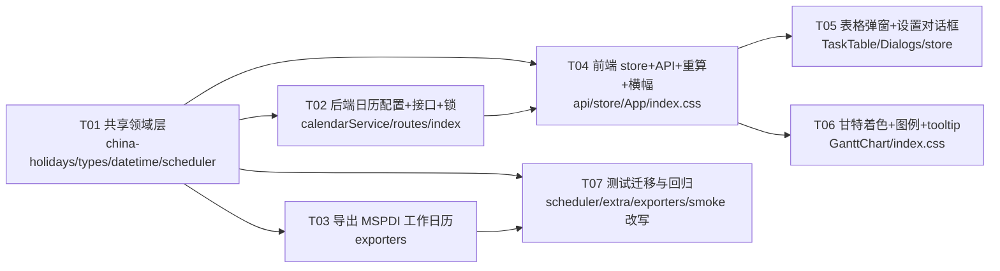

# 增量设计文档：工作日历（非工作日 / 工作日口径）

| 项 | 内容 |
| --- | --- |
| 文档版本 | v1.2（基线 `docs/system_design.md` v1.0 已交付；v1.1 固定名单+负责人 已交付） |
| 架构师 | 高见远（Gao） |
| 形态 | 不变（Vite + React + MUI + Tailwind，Node/Express 中心化服务） |
| 对应 PRD | `docs/prd_increment_calendar.md`（已交付，含 Q1–Q7） |
| 硬前提 | 主理人最终确认 **D1–D9**（其中 **D2 推翻 PRD Q1 与基线 U2 的自然月口径**，以 D2 为准） |
| 目标读者 | 工程师（寇豆，据此一次性改对）+ QA（严过关，据 N3 精准回归） |

> 本文件是**增量 diff 视角**。未提及的文件/逻辑一律视为**保持不变**，请勿重写。

---

## 0. 主理人硬前提速记（全篇以此为准，不得再议）

- **D1** 排程口径：工期只计**工作日**，自动跳过非工作日（真正工作日历，对齐 MS Project）。
- **D2** 单位口径**全部按工作日**（⚠ 推翻 PRD Q1 + 基线 U2 自然月口径）：
  - `1d` = 1 个工作日；`1w` = 5 个工作日；`1m` = 4w = **20 个工作日**（不再是自然月；`2026-08-26 +1m` ≠ `2026-09-26`）。
  - `diffDuration` 逆运算按**工作日计数**归约，优先级 `m`(工作日数 `%20==0` 且 `≥20`) > `w`(`%5==0` 且 `≥5`) > `d`（见 §7 N1 + §2.3）。
- **D3** `lag` 偏移同样走工作日历：`3FF+1w` 的 `+1w` = +5 个工作日；不引入 elapsed 单位。
- **D4** 日历数据源：内置表**只含已核实的 2026 年**（下方权威数据）；**2027 及以后不预填、不编造**，降级「仅周六日为非工作日」+ 前端横幅提示；默认周六日非工作；调休补班日覆盖周末默认变回工作。
- **D5** 两条链路分离：排程**推算**出的 start 落非工作日 → **自动顺延**到下一工作日，**不弹窗**；用户**手填**的日期落非工作日 → **弹窗二选一**（仍使用 / 顺延），不阻断、不报 Diagnostic。
- **D6** 设置作用域全局：一份 `DATA_DIR/calendar.json`，所有计划共用；审计写独立 `calendar-history.json`；编辑复用 `LockService`（全局资源标识 `GLOBAL_CALENDAR`）。
- **D7** 存量迁移无需考虑：`DATA_DIR` 内零真实计划（已确认并清理），工作日历常驻，打开旧计划给信息横幅即可，**不做双口径兼容、不做迁移脚本、不保留旧口径标记**。
- **D8** `shared/` 继续保持**零副作用纯函数**：`WorkCalendar` 由 server/前端各自加载后以参数注入。
- **D9** **不新增 ErrCode 段位**：非工作日提示是 UI 态/横幅，不是 Diagnostic。

> ⚠ **与基线/PRD 的关键分歧确认**：基线 U2 与 PRD Q1 均把 `1m` 当作自然月（`2026-08-26+1m=2026-09-26`）。**D2 推翻此口径**：`1m=20 工作日`，故 `2026-08-26+1m=2026-09-23`（2026 周末口径下）。全文档以下文 D2 口径为唯一标准。

---

## 1. 增量变更点清单（对基线的 diff）

### 1.1 改动 / 新增的文件

| 文件 | 改什么 | 说明 / 验收要点 |
| --- | --- | --- |
| `shared/china-holidays.ts` | **新增** | 内置 2026 权威节假日 + 补班（含 2027 空表）；`COVERED_YEARS=[2026]` |
| `shared/types.ts` | 改 | 新增 `WorkCalendar` 接口、`CalendarConfigData`、`ScheduleOptions.calendar?`；`CalendarConfig.mode` 扩为 `'NATURAL'\|'WORKWEEK5'`；**ErrCode 不变** |
| `shared/datetime.ts` | 改 | `addDuration/subDuration/diffDuration/lagToDays` 增 `cal?` 形参；新增 `addWorkingDays/isWorkingDay/nextWorkingDay/countWorkingDays`；默认 `NATURAL_CALENDAR`（全工作日）兜底 |
| `shared/scheduler.ts` | 改 | `ScheduleOptions.calendar?` 注入；`resolveLeaf` 全部日期运算透传 `cal`；**推算 start 自动顺延 `nextWorkingDay`**；`ERR_NEGATIVE_DURATION` 判定改为 `countWorkingDays===0`；`normalizePlan` 不再强制 `NATURAL`（置 `WORKWEEK5` 标记，不驱动排程） |
| `server/config.ts` | 改 | 新增 `calendarFile()` / `calendarHistoryFile()` 路径辅助（K15，禁止字面量） |
| `server/calendarService.ts` | **新增** | `loadCalendar` / `saveCalendar`（写 json + append history）/ `buildWorkCalendar` / `seedIfAbsent`（启动种子） |
| `server/routes.ts` | 改 | 新增 `GET/PUT /api/calendar`（**不加** `requirePlanExists`）；calendar 路由直接调用 `lockService` 的 `GLOBAL_CALENDAR` 资源 |
| `server/index.ts` | 改 | 启动时 `calendarService.seedIfAbsent()` |
| `server/exporters.ts` | 改 | `<Calendars>` 改「周一~周五 8h + 节假日例外 + 补班例外」；`Duration` 改用**工作日数×8h**；`LinkLag` 用工作日感知的 `lagToDays`；`toMsProjectXml/ toCsv` 增 `cal` 形参 |
| `src/api.ts` | 改 | 新增 `getCalendar()` / `putCalendar()` |
| `src/store.ts` | 改 | 新增 `calendar` 状态 + `loadCalendar` + `saveCalendar` + `openCalendarDialog`；`recompute()` 注入 `calendar`；`updateCell` 前对 start/end 拦截非工作日（pending 状态 + 弹窗）；横幅标志 `legacyMode`/`outOfRangeYears` |
| `src/App.tsx` | 改 | 顶部新增两条横幅（P0-8 旧计划提示 / P1-1 超范围年份提示） |
| `src/components/TaskTable.tsx` | 改 | start/end 的 `CellInput` 提交**前**拦截：非工作日 → 挂起并打开确认弹窗（插在 blur/Enter 提交链路，提交 store 之前） |
| `src/components/GanttChart.tsx` | 改 | `AxisTick` 增 `nonWorking`/`holiday` 三态；周末/法定假日不同色、补班不着色；图例更新；hover tooltip 显示是否工作日（P1-2） |
| `src/components/Dialogs.tsx` | 改 | 新增 `NonWorkingDayDialog`（确认二选一）+ `CalendarSettingsDialog`（年切换 + 月历网格 + 重置默认 + 保存 + 历史回滚 P1-3）；`DialogName` 扩 `'calendar'\|'nonworking'` |
| `src/index.css` | 改 | 新增 CSS 变量 `--gantt-weekend` / `--gantt-holiday` / `--gantt-makeup`（浅色默认值；dark 主题接入点，见 §10 U-calendar-1） |
| `shared/__tests__/calendar.test.ts` | **新增** | 工作日历纯函数单测（addWorkingDays/isWorkingDay/diffDuration 工作日归约/round-trip） |
| 测试迁移 | 改 | `shared/__tests__/scheduler.test.ts`、`extra.test.ts`、`server/__tests__/exporters.test.ts`、`api.smoke.test.ts` 改写断言（见 §7 N3）；`assignee.test.ts`/`lockService.test.ts` **保持** |

### 1.2 不动的文件 / 红线（务必守住）

- **`shared/scheduler.ts` 的 15 分支决策矩阵结构不变**，仅日期算术换参（C2 已声明）。排程算法主体（拓扑排序、依赖边∪层级边、环检测、父子 rollup）**不变**。
- **owner / 负责人逻辑（K19–K22）完全不受影响**；`schedule()` 仍不读 owner；`assignee.test.ts` 保持全绿（QA 验证见 §7 N3 末段）。
- **编辑锁状态机、版本历史 append-only、notes 必填、`{code,data,message}` 契约不变**。
- **错误码段（1000/2000/3000/5000）不新增**（D9）：非工作日提示是 UI 态/横幅，不是 Diagnostic。
- **`shared/` 仍零 fs / 零 DOM 纯函数**（WorkCalendar 由 server/前端加载后注入，见 D8）。
- **CSV 列结构不变**（仍含「负责人」列；起止日期自然反映新口径）。
- **K1–K22 全部不变**，仅追加 K23–K30（§9）。

---

## 2. `WorkCalendar` 领域模型与 `shared/china-holidays.ts`

### 2.1 2026 权威数据（国务院办公厅 2025-11-04 发布，主理人已核实，直接写入）

**放假日（非工作，含调休连休）：**
- 元旦：`2026-01-01` `01-02` `01-03`
- 春节：`2026-02-15` ~ `2026-02-23`（连续 9 天）
- 清明：`2026-04-04` `04-05` `04-06`
- 劳动节：`2026-05-01` ~ `2026-05-05`
- 端午：`2026-06-19` `06-20` `06-21`
- 中秋：`2026-09-25` `09-26` `09-27`
- 国庆：`2026-10-01` ~ `2026-10-07`

**调休补班日（本是周末、但为工作日，必须覆盖周末默认）：**
- `2026-01-04`（周日）、`2026-02-14`（周六）、`2026-02-28`（周六）、`2026-05-09`（周六）、`2026-09-20`（周日）、`2026-10-10`（周六）

> 清明、端午、中秋**无补班日**。2027 及以后**不预填**（D4）。

### 2.2 `shared/china-holidays.ts`（新增，前后端共用，零 fs）

```ts
// shared/china-holidays.ts —— 内置中国法定节假日单一真源（禁止第二份硬编码）
import type { ISODate } from './types';

/** 内置法定放假日（非工作）。仅 2026 为已核实权威数据；2027+ 留空（D4 不预填）。 */
export const BUILTIN_HOLIDAYS: Record<number, ISODate[]> = {
  2026: [
    '2026-01-01','2026-01-02','2026-01-03',
    '2026-02-15','2026-02-16','2026-02-17','2026-02-18','2026-02-19','2026-02-20','2026-02-21','2026-02-22','2026-02-23',
    '2026-04-04','2026-04-05','2026-04-06',
    '2026-05-01','2026-05-02','2026-05-03','2026-05-04','2026-05-05',
    '2026-06-19','2026-06-20','2026-06-21',
    '2026-09-25','2026-09-26','2026-09-27',
    '2026-10-01','2026-10-02','2026-10-03','2026-10-04','2026-10-05','2026-10-06','2026-10-07',
  ],
  2027: [], // 公报发布后再补，本期不编造
};

/** 内置调休补班日（周末变工作）。seed 进 calendar.json 的 makeup 字段。 */
export const BUILTIN_MAKEUP: Record<number, ISODate[]> = {
  2026: ['2026-01-04','2026-02-14','2026-02-28','2026-05-09','2026-09-20','2026-10-10'],
  2027: [],
};

/** 已核实覆盖年份（用于降级判断：年份不在其中 → 仅周末规则 + P1-1 横幅）。 */
export const COVERED_YEARS: number[] = [2026];

/** 工作日标签（供甘特 tooltip / 弹窗文案），仅内置法定日有名称。 */
export const HOLIDAY_LABELS: Record<string, string> = {
  '2026-01-01': '元旦','2026-02-15': '春节','2026-04-04': '清明','2026-05-01': '劳动节',
  '2026-06-19': '端午','2026-09-25': '中秋','2026-10-01': '国庆',
  // 其余连休日沿用主节日标签即可（弹窗展示用）
};
```

### 2.3 `WorkCalendar` 数据结构（`shared/types.ts` 新增）

```ts
// shared/types.ts 新增
export interface WorkCalendar {
  /** 该日是否为工作日（排程/着色/导出统一判定入口） */
  isWorking(date: ISODate): boolean;
  /** 是否为法定/自定义非工作日（着色 + tooltip 用） */
  isHoliday(date: ISODate): boolean;
  /** 是否为补班日（周末变工作，不着色） */
  isMakeup(date: ISODate): boolean;
  /** 该日展示标签（'国庆' / '自定义' / null），tooltip 用 */
  labelOf(date: ISODate): string | null;
  /** 已覆盖年份集合（判 P1-1 降级横幅） */
  coveredYears: ReadonlySet<number>;
}

/** 全局日历配置落盘结构（calendar.json）。用户覆盖以 diff 形式存，便于重置与审计。 */
export interface CalendarConfigData {
  schemaVersion: 1;
  version: number;
  updatedBy: string;
  updatedAt: string;            // ISO UTC
  userHolidays: Record<number, ISODate[]>;  // 用户新增的非工作（自定义）
  userRemoved: Record<number, ISODate[]>;    // 用户取消的内置法定日
  makeup: Record<number, ISODate[]>;         // 补班日（含内置 seed）
  coveredYears: number[];
}

/** 全工作日兜底日历（任何未注入 calendar 的调用方得到旧 NATURAL 行为，避免崩溃）。 */
export const NATURAL_CALENDAR: WorkCalendar = {
  isWorking: () => true, isHoliday: () => false, isMakeup: () => false,
  labelOf: () => null, coveredYears: new Set(),
};
```

**`isWorking(date)` 判定规则（核心不变量）：**
```
year = yearOf(date)
if year ∈ coveredYears:
    if date ∈ makeup(年)            → true   // 补班覆盖周末
    if weekend(date)                → false  // 默认周六日非工作
    if date ∈ (BUILTIN ∪ userHolidays) − userRemoved → false
    else                            → true
else:  // 2027+ 未覆盖：降级为仅周末规则
    if weekend(date) → false  else → true   // 无节假日数据
```

> 该判定由 `calendarService.buildWorkCalendar(cfg)` 预编译为 `Set<ISODate>`（holidays 合集 + makeup 合集），`isWorking` 为 O(1) 查表；`coveredYears` 来自 `cfg.coveredYears`（seed 时 = `COVERED_YEARS`）。

---

## 3. `shared/datetime.ts` 新签名 + 关键算法伪代码

### 3.1 新函数签名（calendar 形参如何传、默认值策略）

```ts
// shared/datetime.ts
import type { WorkCalendar } from './types';
import { NATURAL_CALENDAR } from './types';

/** 加/减工期（ENDPOINT 语义，工作日感知）。cal 缺省 NATURAL_CALENDAR（全工作日，向后兼容）。 */
export function addDuration(date: ISODate, dur: Duration, sign: 1 | -1 = 1, cal: WorkCalendar = NATURAL_CALENDAR): ISODate;
export function subDuration(date: ISODate, dur: Duration, cal: WorkCalendar = NATURAL_CALENDAR): ISODate; // = addDuration(date, dur, -1, cal)

/** 逆运算：由 [start,end) 推算工期（工作日计数归约）。cal 缺省 NATURAL。 */
export function diffDuration(start: ISODate, end: ISODate, cal: WorkCalendar = NATURAL_CALENDAR): Duration;

/** lag → 自然日跨度（带符号）；anchor 为依赖所引用端点。cal 缺省 NATURAL。 */
export function lagToDays(lag: Duration | null, sign: 1 | -1, anchor: ISODate, cal: WorkCalendar = NATURAL_CALENDAR): number;

/** 新增：从 start 起第 N 个工作日（N 可为负）。end = addWorkingDays(start,N) + 1 自然日。 */
export function addWorkingDays(start: ISODate, n: number, cal: WorkCalendar = NATURAL_CALENDAR): ISODate;

/** 新增：[a,b) 半开区间内的工作日数（a 计入、b 不计入）。 */
export function countWorkingDays(a: ISODate, b: ISODate, cal: WorkCalendar = NATURAL_CALENDAR): number;

/** 新增：返回 ≥ date 的第一个工作日（date 本身是则原样返回）。 */
export function nextWorkingDay(date: ISODate, cal: WorkCalendar = NATURAL_CALENDAR): ISODate;

/** 新增：是否工作日（透传）。 */
export function isWorkingDay(date: ISODate, cal: WorkCalendar = NATURAL_CALENDAR): boolean;
```

**默认值策略**：所有新增/改造函数在 `cal` 缺省时回退 `NATURAL_CALENDAR`（每天都是工作日），保证：① 任何忘记注入的调用方不崩溃且行为等同旧 NATURAL；② 单测可在不引入日历时验证纯自然日语义。但**全量迁移后**，server 路由与前端 store **必须**显式注入全局 `WorkCalendar`。

### 3.2 关键算法伪代码

```
addWorkingDays(start, n, cal):
  d = parseISODate(start)
  if n >= 0:
    step = +1
  else:
    step = -1
  remaining = abs(n)
  // 起点若本身非工作且 n>0：从起点之后第一个工作日开始数（保证 [start,end) 含 n 个工作日）
  if n > 0 and not cal.isWorking(d): d = nextWorkingDay(d)   // 跳过起点非工作日
  // n<0：向左数 n 个工作日（含 start 若其工作）
  while remaining > 0:
    if cal.isWorking(d): remaining -= 1
    if remaining > 0: d = d.add(step, 'day')
  return formatISODate(d)

// addDuration（工作日感知，规范 end 唯一确定，见 §7 N1a）
addDuration(date, dur, sign, cal):
  n = dur.value * sign
  switch dur.unit:
    'd': wd = n                      // 1d = 1 工作日
    'w': wd = n * 5                  // 1w = 5 工作日
    'm': wd = n * 20                 // 1m = 20 工作日（D2）
  lastWorking = addWorkingDays(date, wd)   // 第 |wd| 个工作日
  return formatISODate(parseISODate(lastWorking).add(1, 'day'))  // 半开排他边界

countWorkingDays(a, b, cal):
  // 单调：b 每 +1 自然日，计数或不变（周末）或 +1（工作）
  lo = min(a,b); hi = max(a,b); sign = (b>=a)?1:-1
  cur = parseISODate(lo); end = parseISODate(hi); cnt = 0
  while cur < end:
    if cal.isWorking(cur): cnt += 1
    cur = cur.add(1,'day')
  return cnt * sign

diffDuration(start, end, cal):   // 工作日归约（D2）
  wd = countWorkingDays(start, end, cal)   // ≥0（end>start）
  if wd >= 20 and wd % 20 == 0: return { value: wd/20, unit: 'm' }
  if wd >= 5  and wd % 5  == 0: return { value: wd/5,  unit: 'w' }
  return { value: wd, unit: 'd' }

nextWorkingDay(date, cal):
  d = parseISODate(date)
  while not cal.isWorking(d): d = d.add(1,'day')
  return formatISODate(d)

lagToDays(lag, sign, anchor, cal):
  return diffDays(anchor, addDuration(anchor, lag, sign, cal))   // 自然日跨度（工作日感知）
```

**性能考量（N 长跨度）：** 单次 `addWorkingDays`/`countWorkingDays` 为 O(跨度自然日)。按 K8/U8 规模（≤1000 行，工期通常数月），最长单任务跨度数百天 → 每次 <1ms；500 行链式排程总迭代 < 数十万次，远低于基线 200ms 预算。**不引入预计算索引**（避免过度设计）；若未来出现 `100m` 级超长工期，再在 `WorkCalendar` 内置「年→年内工作日记数偏移表」优化，当前无需。

---

## 4. `shared/scheduler.ts` 接入方式（排程算法主体结构不变）

### 4.1 `ScheduleOptions.calendar` 注入

```ts
// shared/types.ts（既有 ScheduleOptions 扩展）
export interface ScheduleOptions {
  anchorDate?: ISODate;
  defaultDuration?: string;
  calendar?: WorkCalendar;   // 新增：工作日历；缺省 NATURAL_CALENDAR
}
```

`schedule(plan, opts)` 内部：
```
const cal = opts.calendar ?? NATURAL_CALENDAR;
```
并将 `cal` 透传给 `resolveLeaf` 内**所有** `addDuration/subDuration/diffDuration/lagToDays` 调用（当前这些调用大多已透传 `calendar` 形参占位，仅把 `undefined` 改为 `cal`）。

### 4.2 15 分支决策矩阵中需要额外顺延处理的分支

矩阵结构（§2.4 全 15 条）**不变**。仅两处与「非工作日」相关，需按 D5 加顺延：

| 位置 | 处理 |
| --- | --- |
| **分支 #2/#3/#5/#7（手填 start 或手填 end 推算另一端）** | start 是用户**手填** → **不顺延**（尊重用户输入；若非工作日，由表格弹窗在提交前处理，见 §6.2）。end 按 `addDuration/subDuration` 产出，允许落在非工作日（半开排他边界，见 N1）。 |
| **分支 #4/#6/#8/#9/#11/#12/#13（依赖/锚点推算出 start）** | 推算出的 `start` 若 `!cal.isWorking(start)` → **自动 `start = nextWorkingDay(start)`**，无弹窗（D5 链路线）。`end` 仍按 `addDuration` 规范产出（允许非工作日排他边界），**不**对 end 顺延。 |
| **收尾 `ERR_NEGATIVE_DURATION`（原 `end <= start`）** | 判定改为 **`countWorkingDays(start, end, cal) === 0`**（见 N1d）。命中则 `end = addDuration(start, DEF, 1, cal)`（保证 ≥1 工作日）。 |
| **anchor（#10/#14，无任何约束）** | `anchor` 视为配置/用户指定的确切日期，**不顺延**（详见 §10 U-calendar-4）。若未来要求锚点也跳过非工作日，仅将 `ctx.anchor` 改为 `nextWorkingDay(anchor, cal)` 一行。 |

> **父子 rollup 不受影响**：rollup 取 `min(子.start)` / `max(子.end)`，纯聚合，不引入新日期运算；子任务 start 已被上述顺延规则处理，父任务天然落在工作边界。

### 4.3 `normalizePlan` 调整

- 不再强制 `mode:'NATURAL'`，改为 `mode:'WORKWEEK5'`（仅作标记，不驱动排程，见 §10 U-calendar-3）；`anchorDate`/`defaultDuration` 保留兜底。
- `calendar.holidays` 字段**忽略**（全局日历来自 `calendar.json`，不读 per-plan holidays，避免与全局冲突，符合 D7）。

---

## 5. 全局日历配置：存储 / 接口 / 锁集成 / 前端加载

### 5.1 落盘结构（DATA_DIR 根目录，独立文件，不进 plan schema）

`DATA_DIR/calendar.json`：
```json
{
  "schemaVersion": 1,
  "version": 3,
  "updatedBy": "User01",
  "updatedAt": "2026-08-26T03:38:21.000Z",
  "userHolidays": { "2026": [], "2027": [] },
  "userRemoved":  { "2026": ["2026-02-16"], "2027": [] },
  "makeup":       { "2026": ["2026-01-04","2026-02-14","2026-02-28","2026-05-09","2026-09-20","2026-10-10"], "2027": [] },
  "coveredYears": [2026]
}
```

`DATA_DIR/calendar-history.json`（审计，append-only，不污染任何 plan）：
```json
{
  "schemaVersion": 1,
  "resourceId": "GLOBAL_CALENDAR",
  "versions": [
    { "version": 1, "timestamp": "2026-08-26T03:38:21.000Z", "editor": "system",
      "summary": "初始化内置 2026 工作日历", "configSnapshot": { /* 完整 CalendarConfigData */ } },
    { "version": 3, "timestamp": "...", "editor": "User01",
      "summary": "取消 2026-02-16 春节法定日", "configSnapshot": { /* 完整 CalendarConfigData */ } }
  ]
}
```
> `configSnapshot` 存完整配置，便于「回滚到上一版」（P1-3）= 以旧快照为新版本追加，不删不改旧记录。

### 5.2 `GET/PUT /api/calendar` 契约（沿用 `{code,data,message}`，K9）

```
GET  /api/calendar
  → 200 { code:0, data: CalendarConfigData, message:'ok' }
  （无需锁；任何人都可读）

PUT  /api/calendar
  body: { editor: string, lockToken: string, config: CalendarConfigData, summary?: string }
  → 成功 200 { code:0, data: CalendarConfigData(新版本), message:'ok' }
  → 失败：2002/2003（锁）/ 1002（summary 缺失且无法生成）/ 400（结构非法）
```

**服务端流程（routes.ts 内联，复用既有 `asyncHandler` + 错误中间件）：**
```
PUT /api/calendar:
  editor = requireEditor(body.editor)
  lockToken = body.lockToken
  lockService.assertHolder('GLOBAL_CALENDAR', editor, lockToken)   // 复用 LockService，资源=全局标识
  cfg = validateCalendarConfig(body.config)                        // 结构校验（ISODate 列表等）
  entry = calendarService.saveCalendar(cfg, editor, lockToken, summary?)  // 写 json + append history
  ok(res, entry)
```

### 5.3 与 `LockService` 的集成（全局资源如何与 per-plan 锁共存）

- `LockService` 以 `planId` 为 key 的内存 Map；`GLOBAL_CALENDAR` 作为**保留资源 id**（非真实 plan 目录，`requirePlanExists` 不应用于 calendar 路由）。
- 直接调用：`lockService.acquire('GLOBAL_CALENDAR', user)` / `heartbeat` / `release` / `status` / `assertHolder('GLOBAL_CALENDAR', ...)`。sweeper/心跳/对外剔除 token 逻辑**完全复用**，零改动。
- 未持锁保存 → `assertHolder` 抛 `ERR_LOCK_LOST(2002)`/`ERR_NO_LOCK(2003)`，前端据此禁用保存并提示「他人正在编辑日历配置」。

### 5.4 前端加载与缓存

- `store.init()` 或 `openPlan()` 时调用 `api.getCalendar()` → 存入 `store.calendar`（`WorkCalendar` 由 `calendarService` 在前端以同样规则 `buildWorkCalendar` 构造；前端同样 import `china-holidays.ts`）。
- `recompute()` 始终用 `store.calendar ?? NATURAL_CALENDAR` 注入 `schedule(plan, {calendar})`。
- 保存日历成功后：`store.calendar` 刷新 → 立即 `recompute()`，全计划实时重算（所有任务日期按新日历刷新）。
- 编辑计划与编辑日历是**两把独立锁**（per-plan vs GLOBAL_CALENDAR），互不阻塞。

---

## 6. 前端改造点

### 6.1 GanttChart 着色与图例（C7 / P0-3，适配主题见 §10）

- `AxisTick` 由 `weekend: boolean` 扩展为三态：`nonWorking: 'weekend' | 'holiday' | null`（补班日 `nonWorking=null`，不着色）。
- 底色渲染（`dayWidth>=10` 日档整列底纹）：
  - `weekend` → `var(--gantt-weekend)`（浅灰，如 `#f1f5f9`）
  - `holiday` → `var(--gantt-holiday)`（浅红，如 `#fde8e8`；dark 下 `#3f1f1f`）
  - 补班日 → 不着色（同工作日）
- 图例（底部）更新：① 任务 ② 父任务汇总 ③ 依赖冲突 ④ **周末（浅灰）** ⑤ **法定节假日（红调）**；注明「调休补班日不着色」。
- hover tooltip（P1-2）：显示「`2026-10-01` 国庆（非工作日）」或「`2026-10-10` 调休补班（工作日）」。
- 着色数据来自 `store.calendar.isHoliday/isMakeup/isWorking`，与 `schedule` 同源，保证一致。

### 6.2 TaskTable 输入校验与弹窗触发时机（C8 / P0-4 / D5）

现有 `CellInput` 是「受控草稿 + 失焦/回车提交」：`onBlur/onKeyDown(Enter)` → `commit(draft)` → `props.onCommit(next)` → `updateCell(...)`。
**弹窗必须插在「提交链路」的 `onCommit` 这一步之前**，即：先校验 `isWorking`，非工作日则挂起并弹窗，用户决策后再真正 `updateCell`。

改造方式（最小侵入）：在 `TaskTable` 的 `TaskRow` 内，对 start/end 列用**包装后的 `onCommit`** 替代直接 `updateCell`：
```
function commitDateCell(field): (raw: string) => void {
  return (raw) => {
    const v = raw.trim();
    if (v === '' || !isValidISODate(v)) { updateCell(task.id, field, v); return; }  // 空/非法走原逻辑
    if (store.calendar.isWorking(v)) { updateCell(task.id, field, v); return; }       // 工作日：直接落库
    // 非工作日：挂起并打开确认弹窗（D5 链路线②）
    setPending({ taskId: task.id, field, value: v,
                 name: store.calendar.labelOf(v) ?? '周末' });
    openDialog('nonworking');
  };
}
```
`NonWorkingDayDialog` 决策：
- 「仍使用该日期」→ `updateCell(pending.taskId, pending.field, pending.value)`（用户显式覆盖；若该 start 参与依赖，按 D5 手动输入不顺延）。
- 「顺延到下一个工作日」→ `updateCell(pending.taskId, pending.field, nextWorkingDay(pending.value, store.calendar))`。
- 任一选择 → `closeDialog('nonworking')` + 清空 pending → `recompute` 自动触发（updateCell 内部）。
> 弹窗**不产生 Diagnostic、不阻断保存**（D9/K10 不受影响）。

### 6.3 非工作日设置对话框（C9 / P0-5 / Q7）

`CalendarSettingsDialog`（风格对齐现有 `Dialogs.tsx`）：
- 顶部：年份切换（`2026` / `2027` / 其它）→ 切年重绘月历。
- 中部：月历网格（整年可滚动），每格状态标：周末（灰底）/ 法定节假日（红调 + 「法定」小标，来自 `BUILTIN_HOLIDAYS`）/ 自定义假期（另一色 + 「自定义」+ 右上×删）/ 补班日（蓝调 + 「班」标，可点回退为普通周末）/ 普通工作日（白底）。
- 点选交互（全存内存草稿，保存时才落盘）：普通工作日→加自定义非工作；内置法定→弹「取消该法定」（写 `userRemoved`）；周末→切补班；自定义/补班→取消恢复默认。
- 底部：摘要「本年非工作日 N 天（法定 M / 自定义 K），调休补班 L 天」+「重置为内置默认」（清 `userHolidays/userRemoved/makeup` 回内置）+「取消」「保存」。保存需持 `GLOBAL_CALENDAR` 锁（未持→禁用+提示）。
- （P1-3）「变更历史」按钮 → 打开 `calendar-history.json` 列表，支持「回滚到上一版」（append 新版本）。

### 6.4 store 如何持有 calendar 并触发 recompute

```ts
// src/store.ts 追加
calendar: WorkCalendar | null;
calendarMeta: CalendarConfigData | null;
legacyMode: boolean;          // plan.calendar.mode !== 'WORKWEEK5' → P0-8 横幅
outOfRangeYears: number[];    // 任务日期年份不在 coveredYears → P1-1 横幅

loadCalendar: async () => { const cfg = await api.getCalendar(); set({ calendarMeta: cfg, calendar: buildWorkCalendar(cfg) }); },
saveCalendar: async (cfg, summary) => { const data = await api.putCalendar(session.user, session.lockToken, cfg, summary); set({ calendarMeta: data, calendar: buildWorkCalendar(data) }); get().recompute(); },

recompute: () => {
  const { plan, calendar, parseDiag } = get();
  if (!plan) { set({ sched: null, diagnostics: [] }); return; }
  const sched = schedule(plan, { anchorDate: plan.calendar.anchorDate, defaultDuration: plan.calendar.defaultDuration || DEFAULT_DURATION_TEXT, calendar: calendar ?? NATURAL_CALENDAR });
  // 横幅标志
  const covered = calendar?.coveredYears ?? new Set([2026]);
  const oor = new Set<number>();
  for (const t of plan.tasks) { for (const d of [t.input.start, t.input.end, sched.computed?.[t.id]?.start, sched.computed?.[t.id]?.end]) if (d && !covered.has(yearOf(d))) oor.add(yearOf(d)); }
  set({ sched, diagnostics: [...Object.values(parseDiag).flat(), ...sched.diagnostics], legacyMode: plan.calendar.mode !== 'WORKWEEK5', outOfRangeYears: [...oor] });
},
```
> `buildWorkCalendar` 在前端由 `china-holidays.ts` + `CalendarConfigData` 构造（与后端同规则，纯函数，零 fs）。

---

## 7. N1–N4 四个难点的明确结论

### N1 · ENDPOINT 半开区间在工作日历下的规范形式与往返一致性

**(a) `addDuration` 产出的规范 `end` 是什么（唯一确定）？**
`end = addWorkingDays(start, N) + 1 自然日`，其中 `N` = 工作日数（d:N / w:5N / m:20N），`addWorkingDays` 取「从 start 起第 N 个工作日」。因 `countWorkingDays(start, end)` 随 end 单调，使计数恰为 N 的最小 end **唯一确定**。例如 start=周五、duration=1d → 第1工作日=周五 → end=周六（排他，仅覆盖周五一列）。✅ 规范 end 唯一。

**(b) 用户手填 start+end（end 落非工作区间内）时 `diffDuration` 如何取值？是否需要归一化 end？**
`diffDuration(start, end)` = `countWorkingDays(start, end)` 按工作日归约（见 §3.2）。**不归一化 end**——半开区间 `[start,end)` 内本就不含 end 当天，周末自然被排除在计数外。手填 `start=周五, end=周一` → `countWorkingDays(周五,周一)=1` → `{1,'d'}`，与 `addDuration(周五,1d)` 的规范 end（周六）在**工作日计数**上一致（均 1），仅 end 落点不同（用户手填的周一 vs 规范周六）。这是用户显式覆盖，合法。

**(c) 基线两条优势是否仍成立？**
- **甘特条无缝衔接**：仍成立。条形仍用 `[start,end)`、`x=diffDays(rangeStart,date)*dayWidth`、宽 `x(end)-x(start)`；周末以着色列呈现间隙，视觉正确（见 N2）。✅
- **FS 依赖无「差一天」bug**：仍成立。`succ.start ≥ pred.end + lag`；`pred.end` 为排他边界（可能周六），配合 **Q4 链路线 start 自动顺延**（推算 start 非工作日→`nextWorkingDay`），链路不差一天。例：`A 5d` 周一→`end=Sat`；`B FS`→`B.start=Sat`→顺延`Mon`。✅

**(d) 收尾校验 `end <= start → ERR 1013` 是否需要调整？**
**需要调整判定**：改为 `countWorkingDays(start, end, cal) === 0`（工作日口径的「零工期」）。理由：`start=周五, end=周六` 工作日跨度 1，合法（**不**报 1013）；而 `start=周六, end=周日`（均非工作）工作日跨度 0，应报 1013。旧 `end <= start` 无法区分这两种，故替换为工作日计数判定。错误码仍 `ERR_NEGATIVE_DURATION(1013)`，自动修正 `end = addDuration(start, DEF, 1, cal)`（保证 ≥1 工作日）。

**(e) 【主理人勘误 · ERRATA-1，优先级高于 §3.2 伪代码】逆向（`sign = -1`）的规范形式**

> 背景：§3.2 的 `addDuration` 伪代码对 `sign=-1` 也套用「`addWorkingDays` 后 +1 自然日」，**这是错的**，会导致往返不闭合，且与本文档 §7 N3 自己给出的期望值互相矛盾。经主理人独立算例验证：
>
> | 场景 | §3.2 伪代码产出 | N3 期望（正确） |
> | --- | --- | --- |
> | `subDuration('2026-09-23', 1m)` | `2026-08-28` ❌ | `2026-08-26` ✅ |
> | `lagToDays({3,'d'}, -1, '2026-08-26')` | `-1` 天 → LinkLag `-4800` ❌ | `-5` 天 → LinkLag `-24000` ✅ |
>
> **N3 的期望值是对的，§3.2 的负向伪代码是错的。以本节为准实现。**

**正确规则（工程师必须照此实现）：**

`addDuration` 按 `sign` 分两支，**不共用 +1 自然日的收尾**：

```
addDuration(date, dur, sign, cal):
  wd = |dur.value| × unitFactor          // d:1 / w:5 / m:20，取正幅值
  if sign > 0:
    // 正向：求 end（半开排他边界）
    last  = addWorkingDaysFwd(date, wd, cal)      // date 若非工作日 → 先 nextWorkingDay；再把它记作第 1 个
    return last + 1 自然日
  else:
    // 逆向：已知 end 求 start，必须是正向的严格逆运算
    base  = date − 1 自然日                        // 先退出半开排他边界
    first = addWorkingDaysBwd(base, wd, cal)      // base 若非工作日 → 先 prevWorkingDay；再把它记作第 1 个
    return first                                   // 不再 +1
```

**新增私有辅助（`shared/datetime.ts`，与 `nextWorkingDay` 对称）：**
```ts
/** 返回 ≤ date 的最后一个工作日（date 本身是则原样返回）。 */
export function prevWorkingDay(date: ISODate, cal?: WorkCalendar): ISODate;
```
`addWorkingDays(start, n, cal)` 对外签名不变，内部按 `n` 正负分别走 `nextWorkingDay` / `prevWorkingDay` 的起点归一。

**验算（工程师自检用，WEEKEND_ONLY 日历，2026-08-26 = 周三）：**

| # | 调用 | 期望 | 推导 |
| --- | --- | --- | --- |
| E1 | `addDuration('2026-08-26',{5,'d'},+1)` | `2026-09-02` | 第5工作日=09-01，+1 |
| E2 | `subDuration('2026-09-02',{5,'d'})` | `2026-08-26` | base=09-01(周二)，倒数第5=08-26 ✅往返闭合 |
| E3 | `subDuration('2026-09-23',{1,'m'})` | `2026-08-26` | base=09-22(周二)，倒数第20=08-26 |
| E4 | `subDuration('2026-08-31',{1,'d'})` | `2026-08-28` | base=08-30(周日)→prev=08-28(周五)，倒数第1=08-28 |
| E5 | `lagToDays({3,'d'},-1,'2026-08-26')` | `-5` | base=08-25(周二)，倒数第3=08-21；`diffDays(08-26,08-21)=-5` |
| E6 | `lagToDays({1,'w'},+1,'2026-09-02')` | `+7` | 正向第5工作日=09-08，+1=09-09；`diffDays=7` → LinkLag 33600 |

**已知且合规的归一化（不是 bug，需在单测中固化为期望行为）：**
`start` 落非工作日时往返会归一到工作日。例 `start='2026-08-29'(周六), 1d` → `end='2026-09-01'`，再 `subDuration` 得 `'2026-08-31'(周一)` 而非周六。原因是正向起点已被 `nextWorkingDay` 归一。**这是期望行为**，单测请直接断言归一后的值，不要试图"修复"它。

### N2 · 甘特条跨非工作日的渲染规则

**结论：整段连续绘制（覆盖周末），不在非工作日处断开/淡化分段。**
- 理由：① 改动最小（现有 `GanttChart` 已是单矩形 `x→x+width`）；② 可读性更佳（单条+时长标签 vs 碎片化）；③ 工作日历语义由**轴底纹**（周末灰/假日红）传达，无需切断条形；④ 与 MS Project 一致（条连续，非工作日为浅色背景）。
- **「1d 任务恰占 1 格」的新表述（K3 修订）**：`1d` = 恰覆盖其 **start 工作日的那一列**（因 `end=start+1 工作日` 落在下一自然日边界，半开条宽恰 1 列）。例：`start=周五` 的 1d 条仅覆盖周五列（`end=周六`）。手填 `start=周五,end=周一`（用户覆盖）时条横跨 4 列但标签仍为 `1d`——轴底纹已解释，可由 P2-3 tooltip「工作日数/自然日数」补充说明（本期不做不影响）。
- 分段绘制作为**已否决方案**记录：实现成本高、碎片化降低可读性、与 MSP 不一致。

### N3 · 既有 84 项测试的迁移策略清单（QA 作业依据，具体到文件与用例名）

> 通用前提：所有 `schedule()` / `addDuration` 类调用现需注入 `WorkCalendar`。**单测夹具统一注入 `WEEKEND_ONLY_CALENDAR`**（仅周末非工作、无节假日，见 §7 末 helper），使断言**不受 2026 节假日数据变动影响**、结果确定。集成/服务测用 2026 感知日历（含节假日例外）。

#### A. `shared/__tests__/scheduler.test.ts`（原 28 项，以下为失效断言 + 新期望）
日期基准：`addDuration` 周末口径（2026-08-26=周三）。

| 用例名 | 旧断言 | 新期望（WEEKEND_ONLY） | 说明 |
| --- | --- | --- | --- |
| `datetime· 2026-08-26 + 1m = 2026-09-26` | `'2026-09-26'` | `'2026-09-23'` | 1m=20 工作日，第20工作日=09-22，end=09-23 |
| `datetime· 2026-01-31 + 1m = 2026-02-28` | `'2026-02-28'` | `'2026-02-28'`（值同，理由变） | 01-31 周六→第1工作日 02-02；第20工作日=02-27，end=02-28 |
| `datetime· 5d/2w 跨度`（5d） | `'2026-08-31'` | `'2026-09-02'` | 5 工作日：26,27,28,31,09-01→end 09-02 |
| `datetime· 5d/2w 跨度`（2w） | `'2026-09-09'` | `'2026-09-09'`（巧合同） | 10 工作日→第10=09-08，end=09-09 |
| `datetime· subDuration 逆` | `subDuration('2026-09-26',{1,'m'})==='2026-08-26'` | 改用 round-trip 对：`subDuration('2026-09-23',{1,'m'})==='2026-08-26'` | 与新增 addDuration 配对 |
| `datetime· diffDuration 优先级`（三例） | `{1,'m'}@(08-26,09-26)` `{2,'w'}@(08-26,09-09)` `{5,'d'}@(08-26,08-31)` | `{1,'m'}@(08-26,09-23)`（20wd）`{2,'w'}@(08-26,09-09)`（10wd）`{3,'d'}@(08-26,08-29)`（3wd） | 5wd 现归约为 `{1,'w'}`，故「d 例」改用 3wd；见 round-trip 说明 |
| `#2 S+D` | end `'2026-09-26'` | `'2026-09-23'` | 1m |
| `#3 E+D 反推` | start `'2026-08-26'`（end `'2026-09-26'`） | 改用 end `'2026-09-23'` → start `'2026-08-26'` | 配对 |
| `#1 S+E 推时长` | duration `{5,'d'}`（end `'2026-08-31'`） | duration `{3,'d'}`（end 仍 `'2026-08-31'`） | countWorkingDays(周三26,周一31)=26,27,28=3wd |
| `#5 仅 S → 缺省 1d` | end `'2026-08-27'` | `'2026-08-27'`（同） | 1d 从周三→周四 |
| `#15 三填冲突 good` | end `'2026-09-26'`+`1m` → WARN_REDUNDANT | 改用 end `'2026-09-23'`+`1m` → WARN_REDUNDANT | 配对一致 |
| `#8 仅时长+FS`（a.end / b.end） | `'2026-08-31'` / `'2026-09-03'` | `'2026-09-02'` / `'2026-09-05'` | a 5d→09-02；b FS 3d→09-05 |
| `FF+1w 依赖驱动结束`（a.end） | `'2026-08-31'` | `'2026-09-02'` | b.end 仍 `'2026-09-09'`（巧合同，因 pred.end 周三+5wd 仍落周三） |
| `两级父任务 rollup`（T-0002.end / T-0001.end） | `'2026-08-31'` / `'2026-10-01'` | `'2026-09-02'` / `'2026-09-29'` | leaf1 5d→09-02；leaf2 1m(20wd from 09-01)=09-29 |
| `父任务可作为前置被依赖`（next.start） | `'2026-08-31'` | `'2026-09-02'` | p.end=leaf 5d→09-02 |
| `projectStart/projectEnd`（projectEnd） | `'2026-10-01'` | `'2026-09-29'` | max(09-02,09-29) |
| `#14 无任何约束`（start） | `'2026-08-26'` | `'2026-08-26'`（同） | anchor 不顺延（§10 U-calendar-4） |
| `#15 三填冲突 bad` / `手填早于依赖→warn1006` / `父任务手填忽略→warn1015` / `A→B→A环` / `子依赖祖先→1011` / `normalizePlan与性能` | — | **保持不变**（仅相对/结构断言，无绝对日期失效） | — |

#### B. `shared/__tests__/extra.test.ts`（字符串 lag 加固）
- `sanitizeDeps` 三例（纯解析）：**不变**。
- `FF+1w 字符串 lag` / `对象型 lag`：`pred.end` 旧 `'2026-09-02'`（巧合**保持**，因 1w 从周三落周三）、`succ.end` 旧 `'2026-09-09'`（巧合**保持**）。→ **本组断言无需改**（验证 round-trip 一致性时 `addDuration('2026-09-02',{1,'w'})` 仍得 `'2026-09-09'`）。`diagnostics error 数===0` 保持。

#### C. `server/__tests__/exporters.test.ts`（MSPDI/CSV）
| 用例 | 旧断言 | 新期望 |
| --- | --- | --- |
| `含 7 天×8h 自然日历` | `toContain('Natural(7x8h)')` + 7 WeekDay | 改写为断言工作日历：含 `<DayType>1</DayType>` 且 `<DayWorking>0</DayWorking>`（周日非工作）；含 `<Exception>`（如国庆 `2026-10-01` 非工作 + `2026-10-10` 补班 working）；Calender Name 不再为 `Natural(7x8h)` |
| `LinkLag FF+1w=33600` | `33600` | **保持 33600**（锚点 pred.end=周三 09-02，+5wd 落 09-09 = 7 自然日 → 7×480×10） |
| `LinkLag SF-3d=-14400` | `-14400` | **`-24000`**（锚点 08-26 周三，−3wd=08-21，diffDays=−5 → −5×480×10） |
| `Duration PT40H0M0S` | `PT40H0M0S` | **保持**（改 exporters 用 `countWorkingDays×8h`：5wd→40h） |
| `Finish 2026-08-30T16:00` | 该值 | `2026-09-01T16:00:00`（pred.end 现为 09-02，−1day） |
| `Start 2026-08-26T08:00` | 该值 | **保持** |
| CSV BOM/表头/任务名 | — | **保持不变**（结构未动） |

#### D. `server/__tests__/api.smoke.test.ts`
- `GET /export?format=xml → 含日历`：旧 `toContain('Natural(7x8h)')` → 改写为断言含工作日历标记（如 `<Exception>` 或周日 `<DayWorking>0</DayWorking>`）。
- 其余（health/users/plans/锁/历史/restore）：**不变**。

#### E. `assignee.test.ts` / `lockService.test.ts` —— **不受影响，保持全绿**
- 负责人逻辑独立于排程（`schedule()` 不读 owner）。`assignee.test.ts` 的「c·owner 不参与排程」两 plan 仅差 owner，注入同一日历后 computed 仍 `toEqual`、且无 `field==='owner'` 的诊断——**结论不变**。
- `lockService.test.ts` 无日期运算，零影响。
- 若 QA 发现 `assignee.test.ts` 中某断言因绝对日期变化而飘红，原因是该测试 plan 的 start/end 经工作日历重算——但 `s2.computed` 与 `s1.computed` 用**同一日历**重算，二者仍全等，不应飘红；若飘红则为测试自身引用了硬编码旧日期，按 §7.A 同类规则更新即可（非 owner 逻辑问题）。

#### 新增单测 `shared/__tests__/calendar.test.ts`（P0-1/P0-2 验收）
- `addWorkingDays`：周五+1wd=周六（end 排他）；周一+5wd=周六；周二+5wd=下周二；跨年/跨节假日正确跳过。
- `countWorkingDays`：含周末/节假日/补班计数正确；补班周六计入。
- `diffDuration` 归约：20wd→m、10wd→w、3wd→d；**round-trip**：`diffDuration(S, addDuration(S,dur))` 与 `dur` 等价（工作日数一致，且规范形归约一致）。
- `isWorking`：2026 国庆非工作、2026-10-10 补班工作、2027-xx 仅周末规则（降级）。
- 内置数据单测：补班周六 `isWorking()==true` 且 `labelOf` 为 `null`（不着色）。

> **测试夹具 helper（建议加在 `shared/__tests__` 或 `shared/datetime.ts` 导出）：**
> ```ts
> export const WEEKEND_ONLY: WorkCalendar = { /* 仅 Sat/Sun 非工作，无节假日，coveredYears=∅ */ };
> ```

### N4 · MSPDI 导出日历改造（C6）

**结论：`<Calendars>` 必须改为「周一~周五 8h + 节假日例外 + 补班例外」，否则 Project 打开后日期漂移。**

xmlbuilder2 写法要点（`toMsProjectXml` 内）：
```
<Calendars>
  <Calendar>
    <UID>1</UID><Name>WorkCalendar(5d×8h)</Name>
    <IsBaseCalendar>1</IsBaseCalendar><BaseCalendarUID>-1</BaseCalendarUID>
    <WeekDays>
      <WeekDay>                         <!-- DayType 1=周日 .. 7=周六 -->
        <DayType>1</DayType><DayWorking>0</DayWorking>   <!-- 周日非工作 -->
      </WeekDay>
      <WeekDay><DayType>2</DayType><DayWorking>1</DayWorking>
        <WorkingTimes><WorkingTime><FromTime>08:00:00</FromTime><ToTime>16:00:00</ToTime></WorkingTime></WorkingTimes>
      </WeekDay>
      ... DayType 3..6 同上（周一~周五 工作 8h）...
      <WeekDay><DayType>7</DayType><DayWorking>0</DayWorking></WeekDay>  <!-- 周六非工作 -->
    </WeekDays>
    <Exceptions>                        <!-- 节假日（非工作）-->
      <Exception><TimePeriodFrom>2026-10-01T00:00:00</TimePeriodFrom><TimePeriodTo>2026-10-07T23:59:00</TimePeriodTo><DayWorking>0</DayWorking></Exception>
      ... 其它内置法定日 ...
    </Exceptions>
    <Exceptions>                        <!-- 补班（工作）-->
      <Exception><TimePeriodFrom>2026-10-10T00:00:00</TimePeriodFrom><TimePeriodTo>2026-10-10T23:59:00</TimePeriodTo><DayWorking>1</DayWorking>
        <WorkingTimes><WorkingTime><FromTime>08:00:00</FromTime><ToTime>16:00:00</ToTime></WorkingTime></WorkingTimes>
      </Exception>
      ... 其它补班日 ...
    </Exceptions>
  </Calendar>
</Calendars>
```
> 注：MSPDI 单日例外用 `<TimePeriodFrom/To>` 框定；多日连休（如国庆 7 天）可每条一个 `<Exception>` 或合并为一个 `From..To` 区间（区间形式 `<DayWorking>0</DayWorking>` 即可）。导出时遍历 `cal` 的 holiday 合集生成非工作例外、makeup 合集生成工作例外。

**`Duration` / `LinkLag` 换算公式（新口径）：**
- `Duration`（任务级）：`PT{countWorkingDays(start, end) × 8}H0M0S`（**改用工作日数**，不再 `diffDays×8h`）。5 工作日任务 → `PT40H0M0S`，与 MS Project 工作日历一致。
- `LinkLag`（依赖级）：`lagToDays(lag, sign, anchor, cal) × 480 × 10`，其中 `lagToDays` 现已工作日感知（`diffDays(anchor, addDuration(anchor,lag,sign,cal))`）。**LinkLag 值随锚点在周内的位置变化**（周一锚点 +1w=5 自然日→24000；周三锚点 +1w=7 自然日→33600）——这正是工作日历的正确表现，MS Project 据此推算出一致日期。

---

## 8. 任务列表（有序、含依赖、按实现顺序，5–7 个）

> 遵循「最小可控改动 + 明确不变量」。复用既有 `shared/`、`store`、`api`、`exporters`，不拆单文件。

| Task | 名称 | 涉及文件 | 依赖 | 优先级 | 验收标准 |
| --- | --- | --- | --- | --- | --- |
| **T01** | 共享领域层：工作日历数据 + datetime + scheduler 注入 | `shared/china-holidays.ts`(新)、`shared/types.ts`、`shared/datetime.ts`、`shared/scheduler.ts`、`shared/__tests__/calendar.test.ts`(新) | — | **P0** | ① 2026 数据按 §2.1 精确写入；② `addDuration(周五,1d)`→周六、`(周一,5d)`→周六、`(周二,5d)`→下周二；③ `diffDuration` 工作日归约 m>w>d 且 round-trip 成立；④ `schedule()` 注入 `calendar` 后 15 分支结构不变、推算 start 自动顺延、ERR1013 改 `countWorkingDays===0`；⑤ `npm run build` 零类型错误 |
| **T02** | 后端：全局日历配置 + 接口 + 锁集成 | `server/calendarService.ts`(新)、`server/config.ts`、`server/routes.ts`、`server/index.ts` | T01 | **P0** | ① 启动 `seedIfAbsent` 生成 `calendar.json`（含内置 makeup seed）；② `GET/PUT /api/calendar` 沿用 `{code,data,message}`；③ PUT 经 `lockService.assertHolder('GLOBAL_CALENDAR')`；④ 写 json + append `calendar-history.json`；⑤ 未持锁→2002/2003 |
| **T03** | 导出层 MSPDI 工作日历改造 | `server/exporters.ts`、`server/__tests__/exporters.test.ts`(改) | T01 | **P0** | ① `<Calendars>` 为周一~周五 8h + 节假日/补班例外；② `Duration`=工作日数×8h（5wd→PT40H0M0S）；③ `LinkLag` 工作日感知（周三锚点 +1w=33600，周一锚点=24000）；④ ProjectLibre 导入起止与 computed 一致 |
| **T04** | 前端 store + API + 全局日历加载与重算 | `src/api.ts`、`src/store.ts`、`src/App.tsx`(横幅)、`src/index.css`(CSS 变量) | T01, T02 | **P0** | ① `getCalendar/putCalendar` 接通；② `store.calendar` 加载后 `recompute` 注入；③ 打开计划显示 P0-8 旧计划横幅、P1-1 超范围横幅；④ 存盘零类型错误 |
| **T05** | 前端表格非工作日弹窗 + 设置对话框 | `src/components/TaskTable.tsx`、`src/components/Dialogs.tsx`、`src/store.ts`(弹窗 pending/保存动作) | T04 | **P1** | ① start/end 提交前拦截：非工作日→`NonWorkingDayDialog` 二选一（仍使用/顺延），不阻断、不报 Diagnostic；② `CalendarSettingsDialog` 年切换+月历网格+重置默认+保存（持 GLOBAL_CALENDAR 锁）；③ 保存后全计划实时重算 |
| **T06** | 前端甘特图着色 + 图例 + tooltip | `src/components/GanttChart.tsx`、`src/index.css` | T04 | **P1** | ① 周末灰/法定假日红调/补班不着色（CSS 变量，主题可读）；② 图例含「法定节假日」并注明补班不着色；③ hover 显示是否工作日（P1-2） |
| **T07** | 测试迁移与回归（守住 84 绿基线） | `shared/__tests__/scheduler.test.ts`、`extra.test.ts`、`server/__tests__/exporters.test.ts`、`api.smoke.test.ts`（改写）；`roster/assignee/lockService` 保持 | T01, T02, T03 | **P0/P1** | ① 按 §7 N3 清单逐一改写失效断言（加 `WEEKEND_ONLY` 注入）；② `npm run test` 全绿 84/84（迁移后计数仍为 84，因仅改断言不改用例数）；③ `roster/assignee/lockService` 零改动且绿；④ `npm run build` 零类型错误 |

### 任务依赖图



---

## 9. 共享知识补充（K23 起，K1–K22 不变）

| # | 约定 | 细则 |
| --- | --- | --- |
| **K23** | **工作日口径统一** | `1d`=1 工作日、`1w`=5 工作日、`1m`=20 工作日（⚠ 推翻基线 U2/PRQ Q1 自然月）。`addDuration` 规范 end = `第N工作日 + 1 自然日`（半开排他边界），唯一确定 |
| **K24** | **diffDuration 工作日归约 + round-trip** | 优先级 `m`(工作日数`%20==0`且`≥20`) > `w`(`%5==0`且`≥5`) > `d`。不变量：`addDuration(start,dur)` 与 `diffDuration(start,end)` 在「工作日数」上互逆；规范形归约下完全一致；`5d≡1w`、`4w≡1m` 是 D2 设计的**预期等价**（非 bug）；手填 duration 文本原样保留（K4），仅推算值走归约 |
| **K25** | **两条链路分离（D5）** | 排程**推算**出的 start 落非工作日 → 自动 `nextWorkingDay`，**无弹窗**；用户**手填** start/end 落非工作日 → **弹窗二选一**（仍使用/顺延），不阻断、不报 Diagnostic（D9） |
| **K26** | **甘特条连续绘制** | 跨非工作日为**单连续矩形**（覆盖周末底纹）；「1d 任务恰占 1 格」修订为：恰覆盖其 **start 工作日的那一列**（因 end=start+1 工作日） |
| **K27** | **全局工作日历单例** | `DATA_DIR/calendar.json` + `calendar-history.json`；所有计划共用；编辑走 `GLOBAL_CALENDAR` 全局锁；server/前端各自 `buildWorkCalendar` 后以参数注入 `schedule/exporters`；`shared` 仍零 fs（D8） |
| **K28** | **2026 权威数据 + 降级** | 内置 `shared/china-holidays.ts`（仅 2026 核实，2027+ 不预填）；补班日覆盖周末为工作；年份不在 `coveredYears` → 仅周末规则 + P1-1 横幅 |
| **K29** | **MSPDI 导出工作日历** | `<Calendars>`=周一~周五 8h + 节假日/补班例外；`Duration`=工作日数×8h；`LinkLag`=自然日跨度(anchor→anchor+lag，工作日感知)×480×10（随锚点变化，符合工作日历） |
| **K30** | **存量迁移最小方案** | 工作日历常驻；旧计划打开显示 P0-8 横幅、`mode` 归一 `WORKWEEK5`；**不做双口径、不写迁移脚本、不保留旧口径标记**（D7） |

---

## 10. 待明确事项（已按默认假设处理）

| # | 事项 | 已采用默认（本设计据此实现） |
| --- | --- | --- |
| **U-calendar-1** | 项目当前**无 dark 主题**（grep "dark" 无结果；`GanttChart` 的 `COLOR` 硬编码浅色）。PRD P0-3 要求「适配现有 dark 主题」 | 引入 CSS 变量 `--gantt-weekend`/`--gantt-holiday`/`--gantt-makeup`（浅色默认值），着色读变量；dark 主题接入时仅改 CSS 变量即可，无需改组件逻辑。若确认永无 dark 主题，可直接用浅色常量（等价） |
| **U-calendar-2** | 2027 及以后节假日数据 | 按 D4「仅 2026 权威数据」，2027+ 留空降级（仅周末 + 横幅）。后续拿到 2027 公报，仅补 `BUILTIN_HOLIDAYS[2027]`/`BUILTIN_MAKEUP[2027]`，逻辑零改动 |
| **U-calendar-3** | `plan.calendar.mode` 字段去留 | D7 单一全局日历，per-plan mode 不驱动排程；`normalizePlan` 置 `mode:'WORKWEEK5'` 作标记，保留 `anchorDate/defaultDuration` 兜底。`schemaVersion` 仍为 1 |
| **U-calendar-4** | 锚点 `anchorDate` 是否顺延 | 默认**不顺延**（视为用户/配置指定确切日期），仅「推算 start」顺延（D5）。若要求锚点也跳过非工作日，改 `ctx.anchor = nextWorkingDay(anchor, cal)` 一行即可 |
| **U-calendar-5** | P1-3 日历历史回滚是否本期实现 | 列入 P1（`CalendarSettingsDialog` 含「变更历史/回滚」）。若时间紧，可降级为仅「查看历史」（回滚按钮 P2），不影响 P0 交付 |

---

## 附：关键不变量速查（给工程师寇豆）

1. **正向** `end = addWorkingDays(start, N) + 1 自然日`，N = d:N / w:5N / m:20N（**唯一确定**）。
   **逆向** `start = addWorkingDaysBwd(end − 1 自然日, N)`，**不 +1** —— 详见 §7 N1(e) ERRATA-1。
   ⚠️ §3.2 伪代码的负向分支已作废，**一律以 N1(e) 为准**。
2. `diffDuration` 按**工作日数**归约：m(≥20 且%20) > w(≥5 且%5) > d；round-trip 在「工作日数」上成立。
3. 推算 start 非工作日 → `nextWorkingDay`（无弹窗）；手填 start/end 非工作日 → 弹窗二选一（不阻断）。
4. `ERR_NEGATIVE_DURATION(1013)` 判定 = `countWorkingDays(start,end)===0`（非 `end<=start`）。
5. `shared` 零 fs：`WorkCalendar` 由 server/前端 `buildWorkCalendar` 后注入 `schedule/exporters`。
6. 全局日历：`DATA_DIR/calendar.json` + `calendar-history.json`；编辑锁资源 `GLOBAL_CALENDAR`。
7. MSPDI：`Duration`=工作日数×8h；`LinkLag`=自然日跨度×480×10（工作日感知，随锚点变）。
8. 红线：`schedule()` 15 分支结构、owner 逻辑、错误码段、append-only 历史、notes 必填——**一律不动**。
