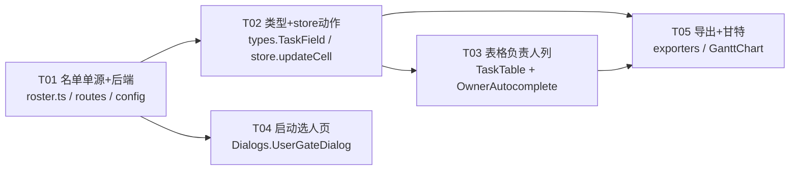

# 增量设计文档：固定人员名单 + 任务负责人（Assignee）

> **⚠ 脱敏说明（2026-09-06）**：本文档描述的是 v1.1.x 时代的「固定名单制」设计。v1.2.0 起硬编码 roster 已移除，人员候选单一真源改为 workspace members（邀请制）。文中 `User01`…`User18` / `Group A` / `Group B` / `External` 均为脱敏占位，非真实人名；原始名单不再保留于本仓库。本文档仅作历史设计归档。

| 项 | 内容 |
| --- | --- |
| 文档版本 | v1.1（基线 `docs/system_design.md` v1.0 已交付） |
| 架构师 | 高见远（Gao） |
| 形态 | 不变（Vite + React + MUI + Tailwind，Node/Express 中心化服务） |
| 对应 PRD | `docs/prd_increment_roster_assignee.md` |
| 目标读者 | 工程师（据此直接编码，不必读基线全文） |

> 本文件是**增量 diff 视角**。未提及的文件/逻辑一律视为**保持不变**，请勿重写。

### 变更记录

| 日期 | 变更 |
| --- | --- |
| 2026-09-01 | 名单增补 `User14`，**插在 `User13` 之后**（索引 13）；由 20 人变为 **21 人**，索引 0→20 |
| 2026-09-02 | 同步本文件的源码示例、单测示例与全部人数口径至 21 人；补齐 `shared/roster.ts` 头注释与 3 处单测期望。用户裁定「User14 保留，且清单内放在 User13 后面」 |

---

## 1. 增量变更点清单（对 system_design 的 diff）

### 1.1 改动的文件

| 文件 | 改什么 | 说明 |
| --- | --- | --- |
| `shared/roster.ts` | **新增**。导出 `BUILTIN_USERS: readonly string[]`（长度 20、严格保序） | 名单唯一真源，前后端共用 |
| `shared/__tests__/roster.test.ts` | **新增**。断言长度 20 + 逐字符顺序 | P0-1 验收 |
| `shared/types.ts` | `TaskField` 联合类型新增 `'owner'` | 让 `updateCell` 复用同一签名承载负责人 |
| `server/routes.ts` | `GET /users` 改为返回 `[...BUILTIN_USERS]`；删除 `readUsers()` 与不再使用的 `fs` 导入 | 接口形状不变（仍 `string[]`） |
| `server/config.ts` | 移除 `usersFile` 字段（接口、`RawFileConfig`、`DEFAULTS`、`load()`） | 名单不再来自文件 |
| `src/api.ts` | **不改**（仍 `getUsers(): Promise<string[]>`） | 接口契约稳定 |
| `src/store.ts` | `updateCell` 增加 `owner` 分支（trim 首尾、保留中间空格、不归一大小写）；`addRow` 新任务 `owner: ''` | 复用 `applyPlan` → 自动置脏 + 重算 |
| `src/components/TaskTable.tsx` | `GRID_COLUMNS` 7→8 列（新增 120px 负责人列）；`MIN_TABLE_WIDTH` 730→850；表头与数据行加「负责人」列；新增 `OwnerAutocomplete` 单元格 | 行高 `ROW_H=32` 不变 |
| `src/components/Dialogs.tsx` | `UserGateDialog` 文案改为「名单为系统内置」；移除「未读取到用户名单」warning 分支；（P1-4）顶部加过滤输入框，过滤为大小写不敏感子串匹配，不提供自由输入 | 候选来自 `store.users` = BUILTIN_USERS |
| `src/components/GanttChart.tsx` | 任务条标签右侧以灰色渲染 `owner`；`month` 缩放档隐藏 | 其余渲染不变 |
| `server/exporters.ts` | CSV `CSV_HEADER` 新增「负责人」列（插「依赖」与「来源」之间）；MSPDI 新增 `<Resources>` + `<Assignments>`（Q3 选型） | 既有列/字段不变 |
| `config/app.config.json` | 删除 `usersFile` 键（可选但推荐） | 避免误导运维 |
| `config/users.json` | **删除**（或保留但标注废弃，永不读取） | 名单已写死进代码 |

### 1.2 不动的文件（重点）

- **`shared/scheduler.ts`（排程引擎）**——**绝不改动**。依赖推算、父子 rollup、三选二决策矩阵、诊断码全部不变。`owner` 不参与 `schedule()` 任何输入/输出，不产生任何 `Diagnostic`。`createEmptyTask` 属工厂函数（非排程逻辑），本设计**不改它**，改由 `store.addRow` 显式补 `owner: ''`。
- `shared/datetime.ts`——不动。
- `server/storage.ts` / `lockService.ts` / `index.ts`——不动。
- `src/App.tsx` / `Toolbar.tsx` / `src/api.ts` / `store.ts` 的保存/锁/历史流程——不动（负责人走既有 `applyPlan` 链路自然纳入脏数据 + notes 必填 + 持锁约束）。

### 1.3 数据落盘现状（确认零迁移）

`Task.owner` 已随 `Plan` 整体序列化（`normalizePlan` 在 `shared/scheduler.ts:401` 已保留 `owner`）。因此：
- 新建/编辑负责人 → 随 `plan.json` 整体写盘；
- 进入版本快照（`history.json` 的 `planSnapshot`）与回滚链路（append-only）→ **天然支持，无需改 storage**；
- 旧 plan.json（无 `owner` 字段）→ `normalizePlan` 不补、UI 显示为空的负责人 → 兼容；
- `SCHEMA_VERSION` 保持 `1`，无 `migrate` 逻辑改动。

---

## 2. 名单常量：位置与加载

### 2.1 唯一真源 `shared/roster.ts`（前后端共用）

```ts
// shared/roster.ts —— 人员名单单一真源（前后端共用，禁止第二份硬编码）
// 顺序严格按需求给定，索引 0..20（共 21 人）；大小写与空格原样保留。
export const BUILTIN_USERS: readonly string[] = [
  'User01', 'User02', 'User03', 'User04', 'User05', 'User06', 'User07', 'User08',
  'User09', 'User10', 'User11', 'User12', 'User13', 'User14', 'User15', 'User16',
  'User17', 'User18', 'Group A', 'Group B', 'External',
] as const;
```

- **禁止**在 `server/`、`src/`、`config/` 任何位置再写一份人名硬编码（P0-2 验收靠全仓检索）。
- 单测（`shared/__tests__/roster.test.ts`）：
  ```ts
  expect(BUILTIN_USERS).toHaveLength(21);
  expect(BUILTIN_USERS).toEqual([
    'User01','User02','User03','User04','User05','User06','User07','User08','User09','User10',
    'User11','User12','User13','User14','User15','User16','User17','User18','Group A','Group B','External',
  ]);
  ```

### 2.2 后端加载（`server/routes.ts`）

删除 `readUsers()`（`fs.readFileSync(config.usersFile)`），`GET /users` 直接返回常量：

```ts
import { BUILTIN_USERS } from '../shared/roster';
// ...
router.get('/users', asyncHandler((_req, res) => { ok(res, [...BUILTIN_USERS]); }));
```

- 接口形状**不变**：仍返回 `string[]`，`src/api.ts:getUsers()` 与 `store.users` 无需改动。
- `routes.ts` 引入的 `fs` 将变为未使用 → 删除该 `import`。

### 2.3 `server/config.ts` 清理

- `AppConfig.usersFile`、`RawFileConfig.usersFile`、`DEFAULTS.usersFile`、`load()` 中 `usersFileRaw`/`usersFile: path.resolve(...)` 全部删除。
- `config/app.config.json` 删除 `usersFile` 键。
- `config/users.json` 删除（或保留但加注释「已废弃，名单见 shared/roster.ts」且**永不读取**）。

### 2.4 前端选人（`src/components/Dialogs.tsx`）

- `UserGateDialog` 数据来自 `store.users`（= `getUsers()` = BUILTIN_USERS），**无需改数据流**。
- 文案：「名单来自 config/users.json」→「名单为系统内置，如需调整请联系开发修改代码」。
- 移除 `users.length === 0 ? <Alert warning>未读取到用户名单…</Alert>` 分支（名单写死后不可达）。
- （P1-4）列表顶部加 `TextField` 过滤框：`users.filter(u => u.toLowerCase().includes(q.trim().toLowerCase()))`；**不提供自由文本入口**（启动身份严格限名单内，现 21 人，见 Q1）。

---

## 3. 数据结构

### 3.1 复用 `Task.owner?: string`（不新增字段）

```ts
// shared/types.ts（已有，仅补充注释说明语义）
export interface Task {
  // ... 既有字段 ...
  /** 负责人（Assignee）。UI 文案统一「负责人」；可空；不参与排程；随 plan 整体序列化。 */
  owner?: string;
  progress?: number;   // 既有扩展位，不受影响
}
```

- `TaskField` 联合类型扩展，使 `updateCell` 复用同一签名：
  ```ts
  export type TaskField = 'start' | 'end' | 'duration' | 'deps' | 'name' | 'owner';
  ```

### 3.2 owner 如何进入落盘 / 版本快照 / 回滚

- 编辑：`store.updateCell(id,'owner',v)` → `applyPlan` → `normalizePlan`（保留 `owner`）→ `plan.json` 整体写盘；`history.json` 的 `planSnapshot` 同样含 `owner` → 回滚天然带回。
- 读取：`openPlan`/`refreshPlan`/`previewVersion`/`restoreVersion` 均走 `normalizePlan` → `owner` 原样回显。
- 旧数据缺 `owner` → `undefined` → UI 显示空 → 兼容，**无迁移脚本**。

### 3.3 负责人列位置与尺寸（`src/components/TaskTable.tsx`）

```ts
// 旧（7 列）：
// const GRID_COLUMNS = '52px minmax(160px,1fr) 96px 96px 78px 110px 136px';
// const MIN_TABLE_WIDTH = 730;

// 新（8 列）：负责人插「依赖」(110px) 之后、「操作」(136px) 之前
const GRID_COLUMNS = '52px minmax(160px,1fr) 96px 96px 78px 110px 120px 136px';
const MIN_TABLE_WIDTH = 850;
```

- 表头顺序：`行号 | 任务名称 | 开始 | 结束 | 时长 | 依赖 | 负责人 | 操作`。
- 行高**严格保持 `ROW_H=32`**（CSS 变量 `--row-h`，K16）；联想下拉用 MUI `Autocomplete` 的 **popper 浮层**（默认 portal）呈现，**绝不改行高、不撑开表格**。

---

## 4. 表格「负责人」列交互（MUI `Autocomplete` + `freeSolo`）

新增单元格组件 `OwnerAutocomplete`（替代该列的 `CellInput`），复用 `CellInput` 的只读展示 + 点击进入编辑的模式：

| 交互 | 行为（设计规格） |
| --- | --- |
| 只读态 | 显示 `task.owner`；空值显示浅灰占位 `—`；`!canEdit` 时 `disabled`（与其他列一致） |
| 进入编辑 | 点击/聚焦 → `Autocomplete` 展开；原值全选便于覆写 |
| 候选源 | `useOwnerCandidates()`（见 §4.1）：固定名单（BUILTIN_USERS，原序）+ 本 plan 内已用过的名单外姓名（去重、排在固定名单之后） |
| 空输入 | 展示**完整 21 人**原序（免费获得「下拉全选」能力） |
| 非空输入 | 大小写不敏感子串匹配（`u.toLowerCase().includes(q.trim().toLowerCase())`）；候选顺序沿用名单原序；**匹配片段高亮**（自定义 `renderOption`，用 `<strong>`/`<mark>` 包裹命中子串） |
| 选中填入 | `↑/↓` 移动高亮项、`Enter` 或点选 → 填入并退出编辑 |
| 名单外自由文本 | 无命中时下拉显示提示项 `使用 "xxx"`；`Enter` 或失焦 → 以自由文本确认保存，**不报错、不回滚**（P0-6） |
| 取消 | `Esc` → 恢复原值 |
| 清空 | 全选删除后确认 → `owner=''` |
| 归一化 | 确认时 `value.trim()`（去首尾空白、**保留中间空格**，如 `Group A` 原样）；**不**做大小写归一（手填 `user01` 就存 `user01`） |

### 4.1 候选选择器（P1-5）

`src/store.ts` 新增派生选择器 `useOwnerCandidates()`：
```ts
export function useOwnerCandidates(): string[] {
  return useStore((s) => {
    const base = BUILTIN_USERS as readonly string[];
    const extra = new Set<string>();
    if (s.plan) for (const t of s.plan.tasks) {
      const o = t.owner?.trim();
      if (o && !base.includes(o)) extra.add(o);
    }
    return [...base, ...extra];   // 固定名单在前、计划内自由文本在后、去重
  });
}
```
> 若图省事，也可在 `TaskTable` 内直接 `import { BUILTIN_USERS }` 并从 `plan` 算 extras，效果相同。

### 4.2 `Autocomplete` 关键 props（防止行高被破坏）

- `freeSolo`、`disablePortal={false}`（popper 浮层）、`forcePopupIcon={false}`、`selectOnFocus`、`clearOnBlur={false}`、`blurOnSelect`、`openOnFocus`。
- 紧凑样式：`size="small"` + `sx={{ '& .MuiInputBase-root': { height: 24, fontSize: 12 }, '& fieldset': { border: 'none' } }}`（与 `.pg-input` 视觉对齐，不撑行高）。

---

## 5. store 动作

### 5.1 `updateCell` 增加 `owner` 分支（`src/store.ts`）

```ts
updateCell: (taskId, field, value) => {
  // ... 既有 deps 分支 ...
  if (field === 'owner') {
    applyPlan((draft) => {
      const t = draft.tasks.find((x) => x.id === taskId);
      if (t) t.owner = value.trim();   // 保留中间空格、不归一大小写；空串即清空
    });
    return;                              // 不走下方 t.input[field]
  }
  applyPlan((draft) => { /* 既有 name/input 处理，不变 */ });
}
```
- `applyPlan` 已自动 `set({dirty:true})` + `recompute()` → **仅改负责人也置脏**（保存按钮激活 + notes 必填生效，P0-8）；
- `recompute()` → `schedule(plan)` → `owner` 不参与任何分支 → 排程结果无差异、无诊断（P0-4）；
- 手填自由文本合法保存不报错（`normalizePlan` 仅校验 `owner` 为 string）。

### 5.2 `addRow` 默认 `owner=''`

```ts
const task: Task = createEmptyTask(newId, 0, parentId, '');
task.owner = '';   // 显式默认，避免 undefined；createEmptyTask 不改动
```

---

## 6. 导出映射

### 6.1 CSV（`server/exporters.ts`）

```ts
const CSV_HEADER = ['行号','任务ID','层级','任务名称(缩进)','父任务ID','开始','结束','时长','依赖','负责人','来源','备注'];
// 数据行追加：
csvCell(t.owner ?? ''),
```
- 列顺序：在「依赖」与「来源」之间插入「负责人」，既有列相对顺序不变（P1-1）。
- 空值导出空串；`"Group A"` 经既有 `csvCell` 转义（含逗号/引号/换行才加引号，空格无需引号，Excel 打开正确）。

### 6.2 甘特条（`src/components/GanttChart.tsx`）

- 任务条标签 `<text>` 中，在任务名后追加负责人（灰色 `tspan`）：
  ```tsx
  <text x={x + w + 6} y={cy + 4} style={{ fontSize: 11 }}>
    <tspan>{t.name}</tspan>
    {owner && dayWidth >= 6 && <tspan fill="#94a3b8">{' · '}{owner}</tspan>}
  </text>
  ```
- `dayWidth >= 6`（即非 `month` 档）才渲染负责人；`month` 档（`dayWidth=3`）隐藏防重叠（P1-3）。
- 父任务汇总条同样适用上述规则。

### 6.3 MS Project XML —— Q3 选型：`<Resources>` + `<Assignments>`（语义最正确）

**决策**：采用 MS Project 原生资源模型。每个被本计划实际使用的负责人（非空、去重、保序）导出为一个 `<Resource>`；每个带负责人的任务导出一条 `<Assignment>` 关联该资源。MS Project 打开后，「资源名称」列直接可见，资源表也可见——语义正确，优于降级方案（自定义字段/并入 Notes）。

**取舍理由（写进文档备查）**：
- 优：在 MS Project 中是「标准负责人表达方式」，可被筛选/分组/资源视图复用；
- 劣：比降级方案（如 `<Notes>` 拼接）改动多约 30 行，但仍在 `exporters.ts` 单文件内、不涉及 schema 变动；成本可控，故**不降级**。
- 若未来 MS Project 2010 以下兼容性出问题，再降级为任务级 `<Notes>` 前缀 `负责人: xxx`（当前不实现）。

**`xmlbuilder2` 写法（在 `toMsProjectXml` 的 Tasks 构建完成后追加）**：

```ts
// 1) 收集本计划实际使用到的负责人（非空、去重、保序）
const usedOwners: string[] = [];
const seenOwner = new Set<string>();
for (const t of tasks) {
  const o = t.owner?.trim();
  if (o && !seenOwner.has(o)) { seenOwner.add(o); usedOwners.push(o); }
}
const resUidOf = new Map<string, number>();
usedOwners.forEach((o, i) => resUidOf.set(o, i + 1));

// 2) <Resources>（置于 <Tasks> 之后）
const resourcesEle = doc.ele('Resources');
usedOwners.forEach((o) => {
  const re = resourcesEle.ele('Resource');
  re.ele('UID').txt(String(resUidOf.get(o))).up();
  re.ele('ID').txt(String(resUidOf.get(o))).up();
  re.ele('Name').txt(o).up();          // 资源名称 = 负责人
  re.ele('Type').txt('1').up();        // 1 = Work
  re.ele('IsNull').txt('0').up();
  re.ele('Active').txt('1').up();
  re.up();
});
resourcesEle.up();

// 3) <Assignments>（置于 <Resources> 之后）
const assignmentsEle = doc.ele('Assignments');
let assignUid = 1;
for (const t of tasks) {
  const o = t.owner?.trim();
  if (!o) continue;
  const resUid = resUidOf.get(o);
  const taskUid = uidOf.get(t.id);
  if (resUid === undefined || taskUid === undefined) continue;
  const ae = assignmentsEle.ele('Assignment');
  ae.ele('UID').txt(String(assignUid++)).up();
  ae.ele('TaskUID').txt(String(taskUid)).up();
  ae.ele('ResourceUID').txt(String(resUid)).up();
  ae.ele('PercentWorkComplete').txt('0').up();
  ae.up();
}
assignmentsEle.up();
```
- 空 `owner` → 不生成资源（也不生成 Assignment）；
- 资源 UID 自 1 递增（与任务 UID 命名空间独立，MSP 各自解析）；
- 仅导出**被使用**的负责人，名单中未用到的不进资源表（最小化文件、避免空资源噪声）。

---

## 7. 启动选人页（`UserGateDialog`）

- 候选 = `store.users` = `getUsers()` = `BUILTIN_USERS`（原序 21 人）。
- 说明文案：「名单来自 config/users.json」→「名单为系统内置，如需调整请联系开发修改代码」。
- 移除 `users.length === 0` 的 warning 分支（写死后不可达）。
- （P1-4）顶部加过滤输入框（大小写不敏感子串；不提供自由输入，符合 Q1）。
- 选中行为不变：`setUser` → 记 localStorage、占锁、记 `updatedBy`。

---

## 8. 任务列表（有序、含依赖、按实现顺序）

> 遵循最小变更原则，复用既有 `shared/`、`store`、`api`、`exporters`。≤ 5 个任务，**不拆单文件**。

| Task | 名称 | 涉及文件 | 依赖 | 优先级 |
| --- | --- | --- | --- | --- |
| **T01** | 名单单源 + 后端切换 | `shared/roster.ts`（新增）、`shared/__tests__/roster.test.ts`（新增）、`server/routes.ts`、`server/config.ts`、`config/app.config.json`、`config/users.json`（删） | — | **P0** |
| **T02** | 类型与 store 负责人动作 | `shared/types.ts`（`TaskField` 加 `'owner'`）、`src/store.ts`（`updateCell` 分支 + `addRow` 默认 `owner`） | T01 | **P0** |
| **T03** | 表格「负责人」列 + 联想输入 | `src/components/TaskTable.tsx`（`GRID_COLUMNS`/`MIN_TABLE_WIDTH`/表头/数据行/`OwnerAutocomplete` 组件） | T02 | **P0** |
| **T04** | 启动选人页改造 | `src/components/Dialogs.tsx`（`UserGateDialog` 文案 + 移除 warning + 过滤框） | T01 | **P1** |
| **T05** | 导出 + 甘特条呈现 | `server/exporters.ts`（CSV 列 + MSPDI Resources/Assignments）、`src/components/GanttChart.tsx`（条标签负责人、month 隐藏） | T02, T03 | **P1** |

### 任务详细说明

**T01 名单单源 + 后端切换（P0）**
- 新增 `shared/roster.ts` 导出 `BUILTIN_USERS`（20 项严格保序，见 §2.1）。
- 新增 `shared/__tests__/roster.test.ts`：长度 20 + 逐字符顺序断言（P0-1 验收）。
- `server/routes.ts`：`GET /users` 返回 `[...BUILTIN_USERS]`；删除 `readUsers()` 与未用的 `fs` 导入。
- `server/config.ts`：删除 `usersFile`（接口/`RawFileConfig`/`DEFAULTS`/`load()`）。
- `config/app.config.json` 删除 `usersFile` 键；`config/users.json` 删除或标注废弃。
- 验收：全仓检索无第二份人名硬编码；`GET /api/users` 返回 21 人且顺序正确。

**T02 类型与 store 负责人动作（P0）**
- `shared/types.ts`：`TaskField` 加 `'owner'`（§3.1）。
- `src/store.ts`：`updateCell` 增加 `owner` 分支（trim 首尾、保留中间空格、不归一大小写、不走 `t.input`）；`addRow` 新任务 `task.owner = ''`（§5）。
- 验收：`schedule()` 回归全绿（owner 不参与排程，P0-4）；仅改负责人 → dirty=true（P0-8 由既有保存约束自然满足）。

**T03 表格「负责人」列 + 联想输入（P0）**
- `TaskTable.tsx`：`GRID_COLUMNS` 改 8 列（§3.3）、`MIN_TABLE_WIDTH` 730→850、表头加「负责人」、数据行加负责人单元格。
- 新增 `OwnerAutocomplete` 组件：`Autocomplete`+`freeSolo`，候选来自 `BUILTIN_USERS` + 计划内自由文本（P1-5），空值展示全名单、子串大小写不敏感过滤 + 命中高亮、自由文本「使用 "xxx"」、Esc 取消、确认 trim、popper 浮层不撑行高。
- 验收：录入名单内/外姓名、清空、Esc 取消均正确；`ROW_H=32` 未被破坏（P0-5/6/9）。

**T04 启动选人页改造（P1）**
- `Dialogs.tsx` `UserGateDialog`：文案改「系统内置」；移除 warning 分支；顶部加过滤输入框（大小写不敏感子串、无自由输入）。
- 验收：展示 21 人且顺序正确、无自由输入入口（P0-7 / Q1）。

**T05 导出 + 甘特条呈现（P1）**
- `exporters.ts`：CSV 新增「负责人」列（§6.1）；MSPDI 新增 `<Resources>`+`<Assignments>`（§6.3）。
- `GanttChart.tsx`：任务条标签追加灰色 `owner`（`month` 档隐藏）。
- 验收：CSV 含「负责人」列且 `Group A` 正确；MS Project 打开可见资源名；甘特条负责人显示、月档隐藏（P1-1/2/3）。

### 任务依赖图



---

## 9. 共享知识补充（扩展既有 K 列表）

| # | 约定 | 细则 |
| --- | --- | --- |
| **K19** | **名单单一真源** | 全 app 人员候选（启动身份 + 任务负责人联想）**只**来自 `shared/roster.ts` 的 `BUILTIN_USERS`（严格保序、长度 20）；`server` 与 `src` 均引用它；代码中不得出现第二份人名硬编码；`config/users.json` 已废弃/删除 |
| **K20** | **owner 不参与排程** | `Task.owner`（负责人）只读写 `task.owner`，**绝不**进入 `shared/scheduler.ts` 任何输入/输出，不产生任何 `Diagnostic`；`schedule()` 回归测试必须保持全绿 |
| K21 | **owner 归一化规则** | 确认时 `trim` 首尾空白、**保留中间空格**（如 `Group A`）、**不**做大小写归一；手填 `user01` 原样存储 |
| K22 | **负责人列位置/尺寸** | 负责人列插「依赖」后、「操作」前；`GRID_COLUMNS` 为 8 列（含 120px 负责人列）；`MIN_TABLE_WIDTH=850`；行高严格 `ROW_H=32`，联想浮层不得撑高 |

> 既有 K1–K18 全部保持不变。

---

## 10. 待明确事项（均已按默认处理）

| # | 事项 | 已采用默认（本设计据此实现） |
| --- | --- | --- |
| Q1 | 名单外自由文本能否作为启动身份 | **否**。启动身份严格限名单内（现 21 人；关联编辑锁归属与 `updatedBy` 审计）；仅任务 Assignee 允许手填自由文本 |
| Q2 | 复用 `owner` 还是新字段 | **复用 `Task.owner`**（已存在、落盘兼容、`SCHEMA_VERSION` 保持 1、零迁移） |
| Q3 | MSPDI 负责人映射 | **`<Resources>` + `<Assignments>`**（语义最正确）；已评估成本可控，不降级；取舍理由见 §6.3 |
| Q4 | 负责人是否必填/校验 | **非必填**，空值合法；**不新增任何 Diagnostic 错误码** |
| Q5 | 联想匹配规则 | **大小写不敏感 + 子串包含**；候选按名单原序；不做拼音/首字母/模糊排序 |
| Q6 | 计划内手填姓名进后续候选 | **是**（P1-5），去重后排固定名单之后；不回写名单常量 |
| Q7 | 名单维护方式 | **改代码 + 重新构建部署**；`config/users.json` 废弃 |
| Q8 | 旧身份（Alice/Bob/Carol）历史数据 | 既有 `updatedBy`/版本 `editor` 旧值**原样保留**（append-only 不可改写）；仅新增记录用新名单 |
| Q9 | 负责人是否进 CSV 导入/回填 | 当前无导入能力，**不涉及**；仅导出方向 |
| **新增** | P2-1 多负责人演进 | 本期落盘为单值 `string`；**不**改为 `string[]`；若未来需要，再以分隔符或字段升级迁移，本期不实现（不影响当前设计） |
| **新增** | `createEmptyTask` 是否改 | **不改** `shared/scheduler.ts`；改由 `store.addRow` 显式补 `owner: ''`，以严格守住「排程引擎不动」红线 |
