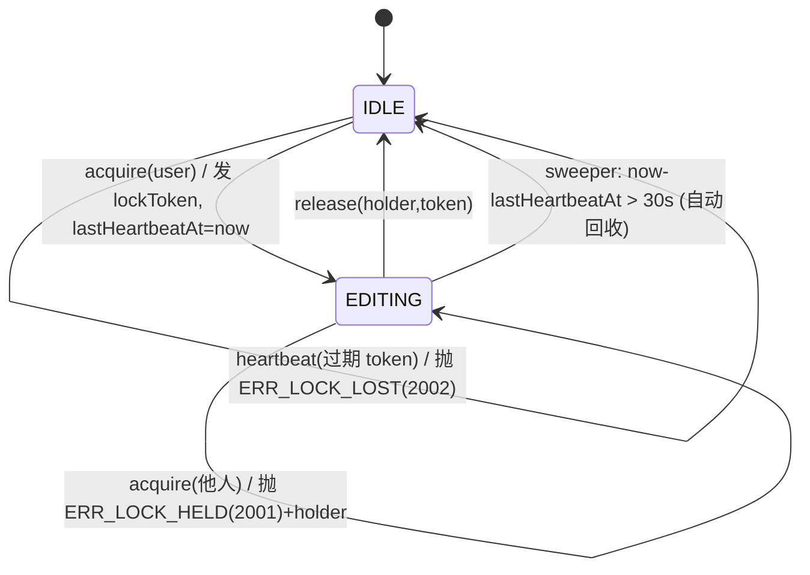
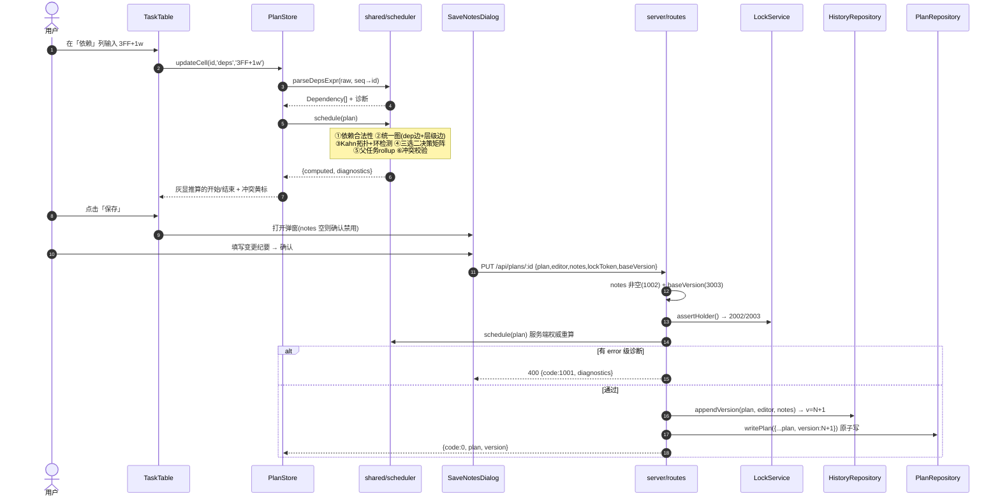
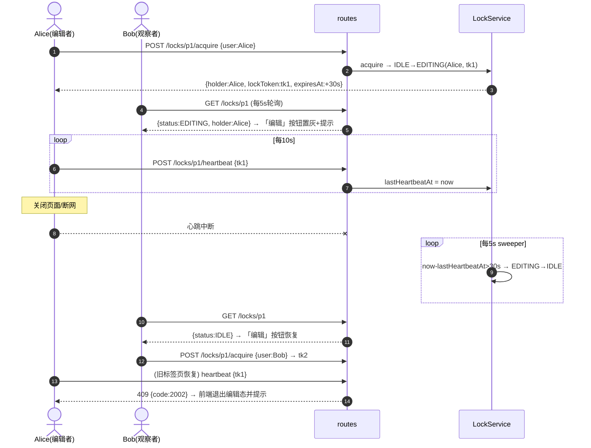
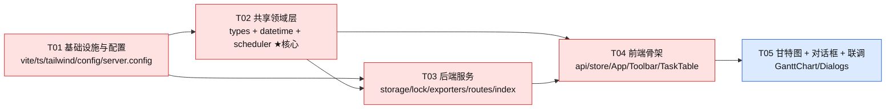

# 系统设计文档 — 内部轻量项目管理 / 甘特图计划工具

| 项 | 内容 |
|---|---|
| 文档版本 | v1.0 |
| 架构师 | 高见远（Gao） |
| 代号 | `plan-gantt` |
| 形态 | 单页 Web App（浏览器访问，Mac/Win 通用）+ 内部中心化 Node 服务 |
| 存储 | 文件型 JSON（`DATA_DIR/plans/<planId>/{plan.json, history.json}`），无数据库 |
| 目标读者 | 工程师（据此直接编码） |

---

# Part A：系统设计

## 1. 实现方案 + 框架选型

### 1.1 技术难点判定

| # | 难点 | 本质 | 应对策略 |
|---|---|---|---|
| D1 | 「三选二」时间约束（开始/结束/时长最多指定 2 个） | 输入与派生混淆会导致状态不可逆、越改越乱 | **input / computed 彻底分离**：`task.input` 是唯一真源（只存用户敲进去的值），`task.computed` 每次全量重算，绝不回写 input |
| D2 | 依赖驱动排程（SS/FS/FF/SF + 偏移）与 D1 交互 | 约束求解顺序敏感 | 单向 ASAP 前向传播 + 拓扑序单遍扫描（不做迭代收敛），规则表化（见 §2.4 决策矩阵） |
| D3 | 父子 rollup 与依赖同图 | 父任务时间派生于子任务，而子任务可能依赖别的父任务 → 求值顺序耦合 | **统一有向图**：依赖边 `pred→succ` ∪ 层级边 `child→parent`，一次拓扑排序解决全部求值顺序；顺带天然检出「子依赖祖先」这类环 |
| D4 | 循环依赖 | 死循环 / 栈溢出 | Kahn 拓扑 + 残余节点 DFS 提取环路径，定位到具体行并降级排程（不崩） |
| D5 | 前后端算法一致性 | 前端实时预览、后端保存校验、导出取值，三处算法必须完全一致 | 抽 `shared/` 纯函数层（零 DOM / 零 Node API），前端 Vite 直接 import，后端用 `tsx` 运行同一份 TS 源码 |
| D6 | 甘特依赖箭头（需标注类型+偏移） | 现成库要么收费（MUI DataGrid Pro / dhtmlx Pro）要么难定制箭头文案 | 手写 SVG 甘特：行高常量对齐 + 正交折线 path + 箭头 marker + 类型/偏移文本标签，完全可控、零 license 风险 |
| D7 | 并发编辑 | 多人同时改 → 覆盖丢失 | 单写锁（内存态）+ 心跳续约 + 服务端扫描回收 + 保存时 `baseVersion` 乐观校验双保险 |
| D8 | MS Project 互通 | MSPDI 对日历/工期单位敏感，导错则 Project 里日期全漂 | 显式导出「7 天工作日历（每日 8h）」，使自然日 == 工期日；工期用 `PT{8×days}H0M0S`；lag 换算为 1/10 分钟 |

### 1.2 选型与理由

| 层 | 选型 | 理由 | 拒绝的方案 |
|---|---|---|---|
| 构建 | **Vite 5 + TypeScript** | 秒级 HMR；`resolve.alias` 让 `@shared` 前后端共用 | CRA（已弃） |
| UI 框架 | **React 18** | 团队默认；受控表格编辑成熟 | Vue（团队栈不符） |
| 组件库 | **MUI 5**（Dialog/Select/Button/Table/Tooltip/Snackbar） | 表单与对话框开箱即用，内部工具审美达标 | Ant Design（与 Tailwind 冲突更多） |
| 原子样式 | **Tailwind CSS 3**（`corePlugins.preflight = false`） | 布局/间距/表格网格用 Tailwind 更快；关掉 preflight 避免覆盖 MUI 基线样式 | 纯 emotion（写布局啰嗦） |
| 状态管理 | **zustand** | 单 store 扁平 selector，避免 Context 全树重渲染；甘特图 300+ 行时性能关键 | Redux Toolkit（样板过重）、Context（性能差） |
| 日期 | **dayjs** + `customParseFormat` | 2KB；`add(n,'month')` 自带月末夹取（01-31 +1m = 02-28），正是需求要的自然月语义 | moment（体积大）、date-fns（月末夹取需手写） |
| 分栏 | **react-resizable-panels** | 左右可拖拽分栏 + 比例持久化，30 行代码省掉 | 手写 drag（易出 bug） |
| 后端 | **Node 20 + Express 4** | 内部工具，生态最熟；同进程静态托管前端 `dist` | Fastify（收益不明显）、NestJS（过重） |
| 后端 TS 运行 | **tsx** | 直接跑 `server/index.ts` 与 `shared/*.ts`，无需单独 build 链 | ts-node（ESM 配置繁琐） |
| XML 生成 | **xmlbuilder2** | MSPDI 结构深、需转义，字符串拼接易错 | 手写模板字符串 |
| 存储 | **文件型 JSON + 原子写（tmp→rename）** | 需求明确不引数据库；单写锁下无并发写风险 | SQLite（违背需求）、lowdb（额外抽象） |
| 甘特渲染 | **手写 SVG** | 见 D6 | dhtmlx-gantt / frappe-gantt（依赖箭头类型标注难改） |

### 1.3 架构分层（严格单向依赖，为后续迭代预留扩展位）

```
┌──────────────────────── 浏览器 (SPA) ────────────────────────┐
│  展示层   Toolbar / TaskTable / GanttChart / Dialogs         │
│  状态层   store.ts (zustand)  ── 编辑动作 + 实时重算调度      │
│  通道层   api.ts (fetch 封装 + 统一 {code,data,message} 解包) │
└───────────────────────────────┬──────────────────────────────┘
                                │ HTTP /api
┌───────────────────────────────┴──────────────────────────────┐
│  路由层   server/routes.ts     (校验 / 鉴身份 / 组装响应)      │
│  服务层   lockService.ts  exporters.ts                        │
│  存储层   storage.ts  (PlanRepository / HistoryRepository)    │
│  配置层   config.ts   (env > config/app.config.json > 默认值) │
└───────────────────────────────┬──────────────────────────────┘
                                │ fs
                        DATA_DIR/plans/<planId>/
┌──────────────────────────────────────────────────────────────┐
│  ★ shared/ 纯领域层（前后端共用，零副作用、可单测）            │
│    types.ts  datetime.ts  scheduler.ts                        │
└──────────────────────────────────────────────────────────────┘
```

**预留的扩展位**（本期不实现，但接口/字段已留好）：

| 扩展位 | 预留方式 |
|---|---|
| 工作日历（跳周末/节假日） | `Plan.calendar = { mode: 'NATURAL' \| 'WORKWEEK5', holidays: [] }`，`datetime.ts` 全部日期运算走 `addDuration(date, dur, calendar)` 签名，本期 `mode` 固定 `NATURAL` |
| 资源 / 负责人 / 进度% | `Task` 预留可选字段 `owner?`, `progress?`（表格暂不显示，导出已占位） |
| 里程碑 | `duration === 0` 即里程碑（导出 XML 时 `<Milestone>1`），本期 UI 不暴露 |
| 多计划并发 / 多进程部署 | `LockService` 抽成接口，本期内存实现 `MemoryLockStore`，后续可换 `FileLockStore`（`DATA_DIR/locks/<planId>.json`） |
| 历史文件膨胀 | `history.json` 预留 `versions[].snapshotRef?`，超阈值时快照外置到 `snapshots/v{n}.json` |
| 迁移 | 所有落盘文件带 `schemaVersion`，`storage.ts` 留 `migrate(raw)` 钩子 |

---

## 2. 核心算法与数据结构（工程师按此实现）

### 2.1 日期与时长约定（★ 全局最重要的一条约定）

**采用「端点式（ENDPOINT）」时间语义**：`end = addDuration(start, duration)`，即 `duration` 表示从 start 到 end 的跨度，甘特条形为 **左闭右开 `[start, end)`**。

```
addDuration(date, {value:N, unit}):
  'd' → date.add(N, 'day')
  'w' → date.add(7 * N, 'day')
  'm' → date.add(N, 'month')      // dayjs 自带月末夹取
```

| 例子 | 结果 | 说明 |
|---|---|---|
| `2026-08-26` + `1m` | `2026-09-26` | 与需求确认口径**逐字一致** |
| `2026-08-26` + `5d` | `2026-08-31` | 跨度 5 天 |
| `2026-08-26` + `2w` | `2026-09-09` | 14 天 |
| `2026-01-31` + `1m` | `2026-02-28` | 月末夹取 |
| 最短任务 | `start=D, end=D+1d`，`duration=1d` | 禁止 `end <= start` |

选择 ENDPOINT 而非 inclusive 的三条工程理由：
1. 需求给定的 `+1m = 09-26` 无需任何 ±1 天补偿；
2. FS 依赖 `succ.start = pred.end + lag` 直接成立，链式排程无「差一天」bug（inclusive 语义必须处处 +1/−1）；
3. `[start, end)` 半开区间画甘特条无缝衔接，1d 任务恰好占 1 格。

> 导出 MS Project 时做**一次性**转换（MSP 是 inclusive）：`MSP.Finish = end − 1 day @16:00`，见 §2.7。

**逆运算 `diffDuration(start, end)`（推算时长时的单位选择优先级）**：
```
m: months = end.diff(start,'month'); if months>=1 && addMonths(start,months)==end → {months,'m'}
w: days = diffDays(start,end);       if days>=7 && days%7==0                     → {days/7,'w'}
d: 否则                                                                          → {days,'d'}
```

**时长文本解析** `parseDuration(text)`：正则 `^\s*(\d+(?:\.\d+)?)\s*([dwmDWM])\s*$`；无单位时默认 `d`（`"5"` → `5d`）；单位大小写不敏感，规范化为小写；非法 → `ERR_DURATION_PARSE(1008)`。小数仅 `d` 允许（向上取整为整日，并给 warn）。

### 2.2 依赖表达式语法与解析

```ebnf
depsExpr := depItem ( ',' depItem )*
depItem  := rowRef type? lag?
rowRef   := INTEGER                      ; 表格行号 seq（1-based，用户所见）
type     := 'FS' | 'SS' | 'FF' | 'SF'    ; 缺省 FS，大小写不敏感
lag      := ('+'|'-') INTEGER ('d'|'w'|'m')
```

单项正则（trim 后逐项匹配）：
```
/^(\d+)\s*(FS|SS|FF|SF)?\s*(?:([+-])\s*(\d+)\s*([dwm]))?$/i
```

| 用户输入 | 解析结果 |
|---|---|
| `3FF+1w` | `[{predRow:3, type:'FF', lagSign:+1, lag:{1,'w'}}]` |
| `2FS,5SS+2d` | 两条依赖 |
| `4` | `[{predRow:4, type:'FS', lag:null}]`（缺省 FS） |
| `7ss-3d` | `[{predRow:7, type:'SS', lagSign:-1, lag:{3,'d'}}]` |
| `3FF+1x` / `abc` | `ERR_DEP_PARSE(1005)`，该行依赖单元格红框，整行降级为无依赖 |

**存储 vs 显示（★ 必守）**：
- `plan.json` 中依赖以**稳定 ID** 存储：`deps: [{predecessorId:'T-0003', type:'FF', lag:{1,'w'}, lagSign:1}]`；
- 表格展示时用 `formatDepsExpr(deps, idToSeq)` 反查**当前行号**渲染；
- 因此插入/删除/移动行后，依赖自动跟随，不会错位。

解析期硬校验（error 级，该依赖被丢弃但不阻断渲染）：

| 校验 | 错误码 |
|---|---|
| 行号不存在 | `ERR_DEP_TARGET_MISSING(1009)` |
| 自引用（predId == 自身） | `ERR_DEP_SELF(1010)` |
| 前置是自己的祖先或后代 | `ERR_DEP_ANCESTOR(1011)` |
| 父任务作为「后继」被依赖驱动 | warn `WARN_PARENT_DEP_IGNORED(1012)`（父任务时间只由 rollup 决定；父任务**可以**作为前置被别人依赖） |

### 2.3 依赖约束求值

| 类型 | 语义 | 约束式 | 产出候选 |
|---|---|---|---|
| **FS** | Finish→Start（默认） | `succ.start ≥ pred.end + lag` | `candStart` |
| **SS** | Start→Start | `succ.start ≥ pred.start + lag` | `candStart` |
| **FF** | Finish→Finish | `succ.end ≥ pred.end + lag` | `candEnd` |
| **SF** | Start→Finish | `succ.end ≥ pred.start + lag` | `candEnd` |

```
cs = max( 所有 FS/SS 的 candStart )   // 无则 null
ce = max( 所有 FF/SF 的 candEnd )     // 无则 null
lag 计算：addDuration(anchorDate, lag, lagSign)，anchor = 该约束所引用的 pred 端点日期
         （必须以 pred 端点为锚，'m' 才有正确自然月长度）
```

### 2.4 「三选二」× 依赖 的决策矩阵（叶子任务）

记 `S=input.start`, `E=input.end`, `D=parseDuration(input.duration)`，`DEFAULT_D = 1d`，`anchor = calendar.anchorDate`（默认今天）。

| # | 输入 | 依赖候选 | start | end | derivedFrom | 诊断 |
|---|---|---|---|---|---|---|
| 1 | S+E | 任意 | `S` | `E` | INPUT | 若 `cs>S` 或 `ce>E` → warn `WARN_DEP_CONFLICT` |
| 2 | S+D | 任意 | `S` | `add(S,D)` | INPUT | 同上 |
| 3 | E+D | 任意 | `sub(E,D)` | `E` | INPUT | 同上 |
| 4 | S | 有 ce | `S` | `max(ce, S+1d)` | MIXED | — |
| 5 | S | 无 ce | `S` | `add(S,DEFAULT_D)` | INPUT | warn `WARN_DURATION_DEFAULTED` |
| 6 | E | 有 cs 且 `cs<E` | `cs` | `E` | MIXED | — |
| 7 | E | 其他 | `sub(E,DEFAULT_D)` | `E` | INPUT | warn `WARN_DURATION_DEFAULTED` |
| 8 | D | 有 cs | `cs` | `add(cs,D)` | DEP | — |
| 9 | D | 仅 ce | `sub(ce,D)` | `ce` | DEP | — |
| 10 | D | 无依赖 | `anchor` | `add(anchor,D)` | ANCHOR | warn `WARN_UNSCHEDULED` |
| 11 | 无 | cs 且 ce | `cs` | `max(ce, cs+1d)` | DEP | — |
| 12 | 无 | 仅 cs | `cs` | `add(cs,DEFAULT_D)` | DEP | warn `WARN_DURATION_DEFAULTED` |
| 13 | 无 | 仅 ce | `sub(ce,DEFAULT_D)` | `ce` | DEP | — |
| 14 | 无 | 无 | `anchor` | `add(anchor,DEFAULT_D)` | ANCHOR | warn `WARN_UNSCHEDULED` |
| 15 | S+E+D 三个都填 | — | 以 S+E 为准 | 以 S+E 为准 | INPUT | `add(S,D)==E` → warn `WARN_REDUNDANT_INPUT`；否则 **error** `ERR_OVER_CONSTRAINED(1003)` |

收尾统一处理：
```
if (end <= start) { diagnostics.push(error ERR_NEGATIVE_DURATION(1013)); end = add(start, DEFAULT_D); }
computed.duration = diffDuration(start, end);
computed.fieldSources = { start:'INPUT'|'DEP'|'ANCHOR', end:..., duration:... }   // 供 UI 灰显推算值
```

> **UI 呈现约定**：`fieldSources[f] === 'INPUT'` → 正常黑色可编辑；否则灰色斜体 + tooltip 说明来源（如「由 3FF+1w 推算」）。用户在灰色格里输入即变为 INPUT；清空则回落为推算。

### 2.5 父子 rollup + 统一拓扑排序（`schedule()` 主流程）

```ts
function schedule(plan, opts): ScheduleResult {
  // ① 建索引
  const byId = new Map(plan.tasks.map(t => [t.id, t]));
  const childrenOf = groupBy(plan.tasks, t => t.parentId ?? '__root');
  const isParent = id => (childrenOf.get(id)?.length ?? 0) > 0;
  const depth  = 计算树深度(cycle-safe，父指针成环时截断并报 ERR_PARENT_CYCLE(1014));

  // ② 依赖合法性过滤（§2.2 硬校验）
  // ③ 建统一有向图：求值先后顺序
  //    依赖边：  pred.id  → succ.id      （前置先算）
  //    层级边：  child.id → parent.id    （子先算，父再 rollup）
  // ④ Kahn 拓扑排序
  const { order, residual } = topoSort(graph);
  if (residual.length) {                       // ⑤ 环
     const path = findCycle(graph, residual);  // DFS 回溯出可读环路径 T-3→T-7→T-3
     residual.forEach(id => diag.push(error ERR_CYCLE(1004), taskId:id, message:path));
     order.push(...residual);                  // 降级：按行序继续算，环内依赖被忽略
  }

  // ⑥ 单遍求值（拓扑序保证依赖项已算完）
  for (const id of order) {
    const t = byId.get(id);
    if (isParent(id)) {
       if (t.input.start || t.input.end || t.input.duration)
          diag.push(warn WARN_PARENT_INPUT_IGNORED(1015));
       const kids = childrenOf.get(id).map(k => computed[k.id]);
       computed[id] = {
         start: minDate(kids.map(k => k.start)),
         end:   maxDate(kids.map(k => k.end)),
         duration: diffDuration(start, end),
         derivedFrom: 'ROLLUP', isParent: true, depth: depth[id]
       };
    } else {
       computed[id] = resolveLeaf(t, computed, opts);   // §2.4 决策矩阵
    }
  }
  // ⑦ 项目总跨度
  return { computed, diagnostics, order, projectStart: min(all.start), projectEnd: max(all.end) };
}
```

要点：
- **间接子孙自动生效**：内层父任务在拓扑序中先于外层父任务求值，其 rollup 结果被外层再次汇总，等价于「所有直接+间接子孙的最早开始/最晚结束」；
- **空父任务**（曾有子任务后被删空）按叶子处理；
- **父任务可作为前置被依赖**：因层级边保证父的 rollup 早于依赖它的后继求值；
- **子任务依赖祖先**必然在统一图中成环 → 被 `ERR_DEP_ANCESTOR` 提前拦下（更友好的报错），双重保护；
- 复杂度 `O(V+E)`；300 行 / 600 依赖量级下前端每次按键重算 < 5ms，无需增量。

### 2.6 编辑锁状态机



| 参数 | 默认值 | 可配置项 |
|---|---|---|
| 心跳间隔（前端） | 10s | `lock.heartbeatMs` |
| 锁超时（服务端） | 30s | `lock.timeoutMs` |
| 扫描间隔（服务端 setInterval） | 5s | `lock.sweepMs` |
| 只读端轮询间隔 | 5s | `lock.pollMs` |

实现细节：
- `LockState` 存内存 `Map<planId, LockState>`；进程重启 = 全部释放（内部工具可接受，已记入 §待明确）；
- `lockToken = crypto.randomUUID()`：防止同名用户旧标签页拿旧 token 继续写；
- **写操作（`PUT /plans/:id`、`POST /restore`）必须带 `lockToken`**，服务端 `assertHolder()` 校验，失败 `2002/2003`；
- 前端 `beforeunload` 里 `navigator.sendBeacon(release)` 尽力释放；失败也无妨，30s 后自动回收；
- 前端心跳返回 `holder != me` 或 409 → 立即退出编辑态、弹 Snackbar「编辑权已被回收，未保存的修改请复制备份」，本地改动**保留在内存**不清空（避免用户白干），但保存按钮禁用直到重新抢锁。

### 2.7 版本历史落盘与回放

```
DATA_DIR/
└── plans/
    └── p-20260826-113821-a7f3/
        ├── plan.json          ← 当前最新（含 version、computed 缓存）
        └── history.json       ← append-only 全量快照
```

`history.json`：
```json
{
  "schemaVersion": 1,
  "planId": "p-20260826-113821-a7f3",
  "versions": [
    { "version": 1, "timestamp": "2026-08-26T03:38:21.000Z", "editor": "Alice",
      "notes": "初始版本：搭建 WBS 一级节点", "planSnapshot": { "...完整 Plan..." } },
    { "version": 2, "timestamp": "2026-08-26T05:10:02.000Z", "editor": "Bob",
      "notes": "按客户要求把联调整体后移 1 周（3FF+1w）", "planSnapshot": { "..." } }
  ]
}
```

| 事项 | 规则 |
|---|---|
| 版本号 | **服务端生成**：`max(versions[].version) + 1`，从 1 开始；客户端传的 version 一律忽略 |
| notes 必填校验时机 | ① 前端：`SaveNotesDialog` 确认按钮 `disabled = notes.trim().length === 0`（≤500 字，超出截断提示）；② 服务端：二次校验，空则 `400 ERR_NOTES_REQUIRED(1002)`。**两处都要有**（防绕过） |
| 写盘顺序 | 先 append `history.json`，成功后再写 `plan.json`（历史宁多不少；若 plan.json 写失败，下次打开可从最新版本快照恢复） |
| 原子写 | `writeFileSync(path+'.tmp')` → `renameSync(tmp, path)`；`history.json` 整体重写（内部规模小；> 5MB 时打 warn 日志，走 §1.3 快照外置扩展位） |
| 乐观并发 | 保存请求带 `baseVersion`；`baseVersion !== plan.version` → `409 ERR_STALE_VERSION(3003)`，前端提示「已有更新版本，请刷新」 |
| 回放（预览） | `GET /history/:version` 取快照 → 前端**只读模式**渲染（工具栏显示「正在预览 v3（只读）」+ 退出按钮） |
| 回放（回滚） | `POST /restore {version, notes}` → 取 v3 的 `planSnapshot` 作为内容，**append 为新版本 N+1**，notes 自动前缀 `"[回滚自 v3] "` + 用户输入。**绝不删改历史** |
| 索引 | 不额外维护 index.json；`GET /api/plans` 直接扫 `plans/*/plan.json`（内部计划数量 < 数百，可接受；如需加速走扩展位） |

### 2.8 MS Project XML（MSPDI）字段映射

根元素：`<Project xmlns="http://schemas.microsoft.com/project">`，文件名 `{planName}-v{version}.xml`，`Content-Type: application/xml`。

**Project 级**

| MSPDI 元素 | 值 | 说明 |
|---|---|---|
| `Name` / `Title` | `plan.name` | |
| `StartDate` / `FinishDate` | `projectStart T08:00:00` / `projectEnd T16:00:00` | 无时区本地格式 |
| `CalendarUID` | `1` | 指向下述自然日历 |
| `ScheduleFromStart` | `1` | ASAP 正排 |
| `DurationFormat` | `7` | 7 = days |
| `DefaultTaskType` | `1` | Fixed Duration，避免 Project 用工时反推 |
| `NewTasksAreManual` | `0` | 自动排程 |
| `SpreadPercentComplete` | `0` | |

**Calendars 级（关键，否则 Project 会跳周末导致日期漂移）**
```xml
<Calendars><Calendar>
  <UID>1</UID><Name>Natural(7x8h)</Name><IsBaseCalendar>1</IsBaseCalendar>
  <WeekDays>
    <!-- DayType 1..7 = 周日..周六，全部 DayWorking=1，08:00-16:00 -->
    <WeekDay><DayType>1</DayType><DayWorking>1</DayWorking>
      <WorkingTimes><WorkingTime><FromTime>08:00:00</FromTime><ToTime>16:00:00</ToTime></WorkingTime></WorkingTimes>
    </WeekDay>
    ... 共 7 个 ...
  </WeekDays>
</Calendar></Calendars>
```
> 7 天 × 8h ⇒ 「1 工期日 == 1 自然日」，与本工具 NATURAL 日历语义一致。

**Task 级**（按显示顺序输出，`UID` 从 1 递增）

| MSPDI 元素 | 取值 | 备注 |
|---|---|---|
| `UID` | 输出序号（1..n） | 依赖引用用此值 |
| `ID` | `task.seq` | 显示行号 |
| `Name` | `task.name` | 空名回退 `"未命名任务"` |
| `Active` / `Manual` | `1` / `0` | |
| `Start` | `computed.start + "T08:00:00"` | |
| `Finish` | `(computed.end − 1 day) + "T16:00:00"` | ★ ENDPOINT→inclusive 唯一转换点 |
| `Duration` | `PT{8 × diffDays(start,end)}H0M0S` | 8h/日 |
| `DurationFormat` | `7` | days |
| `Type` | `1` | Fixed Duration |
| `OutlineLevel` | `computed.depth + 1` | 1-based，父子缩进 |
| `Summary` | `computed.isParent ? 1 : 0` | 父任务 |
| `Milestone` | `diffDays==0 ? 1 : 0` | 扩展位 |
| `ConstraintType` / `ConstraintDate` | 父任务：`0`(ASAP)，无日期<br>叶子且 `input.start` 有值：`4`(SNET) + `start T08:00`<br>叶子且仅 `input.end` 有值：`6`(FNET) + `finish T16:00`<br>其他：`0` | ConstraintType 枚举：0 ASAP / 1 ALAP / 2 MSO / 3 MFO / **4 SNET** / 5 SNLT / **6 FNET** / 7 FNLT |
| `PredecessorLink` | 每条依赖一个（父任务不输出依赖） | 见下 |

**PredecessorLink（依赖类型映射，MSPDI 官方枚举）**

| 本工具 | MSPDI `<Type>` | 含义 |
|---|---|---|
| `FF` | **0** | Finish-to-Finish |
| `FS` | **1** | Finish-to-Start |
| `SF` | **2** | Start-to-Finish |
| `SS` | **3** | Start-to-Start |

```xml
<PredecessorLink>
  <PredecessorUID>3</PredecessorUID>
  <Type>0</Type>              <!-- FF -->
  <CrossProject>0</CrossProject>
  <LinkLag>33600</LinkLag>    <!-- +1w = 7d × 480min × 10 = 33600 (单位:1/10 分钟) -->
  <LagFormat>7</LagFormat>    <!-- 7 = days -->
</PredecessorLink>
```
`LinkLag` 换算：`lagDays × 480 × 10`，其中
```
lagDays = diffDays(anchor, addDuration(anchor, lag, sign)) × sign
anchor  = 该依赖所引用的前置端点日期（保证 'm' 取到真实自然月天数）
负偏移 → LinkLag 为负数（Project 支持 lead time）
```

**CSV 导出**（`text/csv`，**带 UTF-8 BOM** 以便 Excel 直接打开）

```csv
行号,任务ID,层级,任务名称(缩进),父任务ID,开始,结束,时长,依赖,来源,备注
1,T-0001,1,需求分析,,2026-08-26,2026-09-26,1m,,INPUT,
2,T-0002,2,  接口梳理,T-0001,2026-08-26,2026-08-31,5d,,INPUT,
3,T-0003,2,  联调,T-0001,2026-09-07,2026-09-26,19d,"2FS,1SS+2d",DEP,
```

---

## 3. 文件列表（26 个文件）

```
plan-gantt/
├── package.json                      # 依赖 + scripts(dev/dev:server/build/start)
├── index.html                        # Vite SPA 入口
├── vite.config.ts                    # react 插件 / @shared 别名 / dev proxy /api→3001
├── tsconfig.json                     # strict + paths: @shared/* @/*
├── tailwind.config.js                # content 扫描 + corePlugins.preflight=false
├── postcss.config.js                 # tailwindcss + autoprefixer
│
├── config/
│   ├── app.config.json               # port / dataDir / lock 参数 / schedule 默认值（部署时改）
│   └── users.json                     # ["Alice","Bob","Carol"] 预设用户名单（部署时改）
│
├── shared/                           # ★ 前后端共用纯领域层（无 DOM / 无 fs）
│   ├── types.ts                      # Plan/Task/Dependency/Duration/Diagnostic/ErrCode/API 契约
│   ├── datetime.ts                   # 日期解析格式化、时长解析、addDuration/diffDuration、min/max
│   └── scheduler.ts                  # 依赖解析、拓扑排序、环检测、三选二求解、父子 rollup、冲突校验
│
├── server/
│   ├── config.ts                     # env > app.config.json > 默认值；DATA_DIR 解析与目录自举
│   ├── storage.ts                    # PlanRepository + HistoryRepository（原子写、ID 生成、migrate 钩子）
│   ├── lockService.ts                # 编辑锁状态机 + 心跳 + sweeper
│   ├── exporters.ts                  # toMsProjectXml(xmlbuilder2) + toCsv
│   ├── routes.ts                     # 全部 /api 路由 + 统一 {code,data,message} + 错误中间件
│   └── index.ts                      # express 启动、静态托管 dist、启动 sweeper
│
└── src/
    ├── main.tsx                      # React 挂载 + MUI ThemeProvider + CssBaseline
    ├── index.css                     # tailwind 指令 + 甘特/表格 CSS 变量(--row-h:32px)
    ├── App.tsx                       # 左右分栏布局 + 诊断条 + 全局快捷键 + 只读/编辑态外框
    ├── api.ts                        # fetch 封装、统一解包、ApiError(code)、exportUrl
    ├── store.ts                      # zustand：plan/schedule/session/lock/dirty + 全部编辑动作
    └── components/
        ├── Toolbar.tsx               # 用户显示 / 编辑锁按钮 / 保存 / 打开 / 新建 / 导出 / 历史 / 缩放
        ├── TaskTable.tsx             # 左侧表格：行ID·名称·开始·结束·时长·依赖；缩进、增删行、灰显推算值
        ├── GanttChart.tsx            # 右侧 SVG：时间轴刻度、任务条、父任务汇总条、依赖箭头+类型偏移标注
        └── Dialogs.tsx               # UserGateDialog / PlanPickerDialog / SaveNotesDialog / HistoryDrawer
```

---

## 4. 数据结构和接口

> 完整类图见 `docs/class-diagram.mermaid`。以下为工程师直接照抄的 TypeScript 契约（`shared/types.ts`）。

### 4.1 领域模型

```ts
export type ISODate = string;          // 'YYYY-MM-DD'（无时区自然日）
export type ISOTimestamp = string;     // '2026-08-26T03:38:21.000Z'（UTC）
export type DurationUnit = 'd' | 'w' | 'm';
export type DepType = 'FS' | 'SS' | 'FF' | 'SF';
export type DeriveSource = 'INPUT' | 'DEP' | 'ROLLUP' | 'ANCHOR' | 'MIXED';

export interface Duration { value: number; unit: DurationUnit }

export interface Dependency {
  predecessorId: string;      // 稳定 ID（落盘用）
  type: DepType;              // 缺省 FS
  lag: Duration | null;
  lagSign: 1 | -1;
  raw: string;                // 用户原文，如 '3FF+1w'（仅用于回显/排错）
}

export interface TaskInput {                 // ★ 唯一真源：只存用户手敲的值
  start: ISODate | null;
  end: ISODate | null;
  duration: string | null;                   // 原文 '5d' / '1m'，保留用户单位偏好
}

export interface TaskComputed {              // ★ 每次全量重算，不可回写 input
  start: ISODate; end: ISODate; duration: Duration;
  derivedFrom: DeriveSource;
  fieldSources: { start: DeriveSource; end: DeriveSource; duration: DeriveSource };
  isParent: boolean; depth: number;          // depth 0-based
  hasError: boolean;
}

export interface Task {
  id: string;                 // 'T-0001' 系统生成，全生命周期不变
  seq: number;                // 显示行号 1-based，随排序重算
  name: string;
  parentId: string | null;
  input: TaskInput;
  deps: Dependency[];
  computed?: TaskComputed;    // 落盘为缓存，读取后仍会重算
  collapsed?: boolean;
  note?: string;
  owner?: string;             // 扩展位
  progress?: number;          // 扩展位 0-100
}

export interface CalendarConfig {
  mode: 'NATURAL';            // 扩展位：'WORKWEEK5'
  holidays?: ISODate[];       // 扩展位
  anchorDate: ISODate;        // 无任何约束时的落脚点，默认创建日
  defaultDuration: string;    // '1d'
}

export interface Plan {
  schemaVersion: 1;
  planId: string;             // 'p-20260826-113821-a7f3'
  name: string;
  version: number;            // 与 history 最新版本号一致
  createdAt: ISOTimestamp; updatedAt: ISOTimestamp; updatedBy: string;
  nextTaskSeq: number;        // 生成 T-xxxx 用，只增不减
  calendar: CalendarConfig;
  tasks: Task[];              // 数组顺序 == 显示顺序（同层内即排序结果）
}

export interface PlanMeta { planId: string; name: string; version: number; updatedAt: ISOTimestamp; updatedBy: string; taskCount: number }
export interface VersionMeta { version: number; timestamp: ISOTimestamp; editor: string; notes: string }
export interface VersionEntry extends VersionMeta { planSnapshot: Plan }
export interface HistoryFile { schemaVersion: 1; planId: string; versions: VersionEntry[] }

export type LockStatus = 'IDLE' | 'EDITING';
export interface LockState {
  planId: string; status: LockStatus;
  holder: string | null; lockToken: string | null;
  since: number | null; lastHeartbeatAt: number | null; expiresAt: number | null;
}
```

### 4.2 诊断与错误码

```ts
export type Level = 'error' | 'warn';
export interface Diagnostic { level: Level; code: number; taskId?: string; field?: 'start'|'end'|'duration'|'deps'|'name'; message: string }
export interface ScheduleResult {
  computed: Record<string, TaskComputed>;
  diagnostics: Diagnostic[];
  order: string[];
  projectStart: ISODate; projectEnd: ISODate;
}
export interface ApiResp<T> { code: number; data: T | null; message: string }
```

| 码 | 常量 | 级别 | HTTP | 触发点 |
|---|---|---|---|---|
| 0 | `OK` | — | 200 | 成功 |
| 1001 | `ERR_VALIDATION` | error | 400 | 保存前存在 error 级诊断 |
| 1002 | `ERR_NOTES_REQUIRED` | error | 400 | notes 为空/纯空白 |
| 1003 | `ERR_OVER_CONSTRAINED` | error | 400 | 开始+结束+时长三者同时指定且互斥 |
| 1004 | `ERR_CYCLE` | error | 400 | 循环依赖（message 含环路径） |
| 1005 | `ERR_DEP_PARSE` | error | — | 依赖表达式语法错误 |
| 1006 | `WARN_DEP_CONFLICT` | warn | — | 手填时间早于依赖要求 |
| 1007 | `ERR_INVALID_DATE` | error | — | 非 `YYYY-MM-DD` 或非法日期 |
| 1008 | `ERR_DURATION_PARSE` | error | — | 时长格式非法 |
| 1009 | `ERR_DEP_TARGET_MISSING` | error | — | 依赖行号不存在 |
| 1010 | `ERR_DEP_SELF` | error | — | 依赖自己 |
| 1011 | `ERR_DEP_ANCESTOR` | error | — | 依赖自己的祖先/后代 |
| 1012 | `WARN_PARENT_DEP_IGNORED` | warn | — | 父任务的依赖不驱动其时间 |
| 1013 | `ERR_NEGATIVE_DURATION` | error | — | `end <= start` |
| 1014 | `ERR_PARENT_CYCLE` | error | — | parentId 成环 |
| 1015 | `WARN_PARENT_INPUT_IGNORED` | warn | — | 父任务手填时间被忽略 |
| 1016 | `WARN_UNSCHEDULED` | warn | — | 无约束、落到 anchorDate |
| 1017 | `WARN_DURATION_DEFAULTED` | warn | — | 时长缺省为 1d |
| 1018 | `WARN_REDUNDANT_INPUT` | warn | — | 三者同填但一致 |
| 2001 | `ERR_LOCK_HELD` | error | 409 | 锁被他人持有（data.holder） |
| 2002 | `ERR_LOCK_LOST` | error | 409 | token 失效/已被回收 |
| 2003 | `ERR_NO_LOCK` | error | 409 | 写操作未带锁 |
| 3001 | `ERR_PLAN_NOT_FOUND` | error | 404 | planId 不存在 |
| 3002 | `ERR_VERSION_NOT_FOUND` | error | 404 | version 不存在 |
| 3003 | `ERR_STALE_VERSION` | error | 409 | baseVersion 落后 |
| 5000 | `ERR_INTERNAL` | error | 500 | 兜底 |

> **约定**：`error` 级诊断存在时禁止保存（按钮禁用 + 诊断条红色可点击定位到行）；`warn` 级允许保存（黄色提示）。

### 4.3 HTTP API 契约

统一响应体 `{ code, data, message }`；`code === 0` 为成功；HTTP 状态码同步语义化。

| Method | Path | Body / Query | Data | 错误 |
|---|---|---|---|---|
| GET | `/api/health` | — | `{ok:true, dataDir, version}` | — |
| GET | `/api/users` | — | `string[]` | 5000 |
| GET | `/api/plans` | — | `PlanMeta[]` | — |
| POST | `/api/plans` | `{name, editor, notes}` | `Plan`（含 v1） | 1002 |
| GET | `/api/plans/:planId` | — | `Plan` | 3001 |
| PUT | `/api/plans/:planId` | `{plan, editor, notes, lockToken, baseVersion}` | `{plan, version}` | 1001/1002/2002/2003/3003 |
| GET | `/api/plans/:planId/history` | — | `VersionMeta[]`（倒序，不含快照） | 3001 |
| GET | `/api/plans/:planId/history/:version` | — | `VersionEntry` | 3002 |
| POST | `/api/plans/:planId/restore` | `{version, editor, notes, lockToken}` | `{plan, version}` | 1002/2002/3002 |
| GET | `/api/plans/:planId/export` | `?format=mspdi\|csv` | 文件流（`Content-Disposition: attachment`） | 3001 |
| GET | `/api/locks/:planId` | — | `LockState`（不含 lockToken） | — |
| POST | `/api/locks/:planId/acquire` | `{user}` | `LockState`（含 lockToken） | 2001 |
| POST | `/api/locks/:planId/heartbeat` | `{user, lockToken}` | `{expiresAt}` | 2002 |
| POST | `/api/locks/:planId/release` | `{user, lockToken}` | `{ok:true}` | 2002 |

### 4.4 前端 store 动作（`src/store.ts`）

| 动作 | 说明 | 触发重算 |
|---|---|---|
| `setUser(name)` | 启动选人 | — |
| `listPlans()` / `openPlan(id)` / `createPlan(name,notes)` | 打开/新建 | ✔ |
| `updateCell(taskId, field, value)` | field ∈ name/start/end/duration/deps；写 `input`，**从不写 computed** | ✔ |
| `addRow(afterTaskId?)` | 生成 `T-xxxx`，继承同级 parentId | ✔ |
| `deleteRow(taskId)` | 连带删子孙 + 清理指向它的依赖（并提示条数） | ✔ |
| `indent(taskId)` / `outdent(taskId)` | 认上一行同级为父 / 升一级；禁止跨越形成环 | ✔ |
| `moveRow(taskId, ±1)` | 同层内上下移动，`seq` 重排 | ✔ |
| `toggleCollapse(taskId)` | 折叠父任务（表格 + 甘特同步隐藏子行） | — |
| `enterEditMode()` / `exitEditMode()` | 抢锁 / 放锁 + 心跳启停 | — |
| `save(notes)` | 校验 → PUT → 更新 version/dirty | — |
| `previewVersion(v)` / `restoreVersion(v, notes)` | 只读预览 / 回滚为新版本 | ✔ |
| `recompute()` | 内部：`schedule(plan)` → 写 `schedule` 切片 | — |

---

## 5. 程序调用流程

> 完整时序图见 `docs/sequence-diagram.mermaid`（含 6 段：启动选人→抢锁→实时排程→保存快照→心跳回收→导出/历史）。下面给出最关键的两段。

### 5.1 编辑 → 实时排程 → 保存（notes 必填）



### 5.2 编辑锁竞争与心跳回收



---

## 6. 界面结构（单页布局）

```
┌───────────────────────────────────────────────────────────────────────────────┐
│ Toolbar: [计划名 v3] [身份:Alice▾] [✎编辑/正在编辑(Bob)] [保存] [打开] [新建]  │
│          [导出▾ MSProject XML|CSV] [变更记录] [缩放: 日|周|月] [今天]           │
├───────────────────────────────────────────────────────────────────────────────┤
│ 诊断条(可折叠)：⛔2 个错误：T-7 循环依赖 …   ⚠3 个提醒：T-3 与依赖冲突 …        │
├──────────────── 左侧表格(可拖拽分栏) ───────────┬──── 右侧甘特(SVG) ──────────┤
│ 行ID │ 任务名称        │ 开始 │ 结束 │ 时长 │依赖│  8月        9月       10月  │
│ T-1  │ ▾ 需求分析      │08-26*│09-26*│ 1m * │    │  ▬▬▬▬▬▬▬▬▬▬▬▬▬(父汇总条)   │
│ T-2  │   接口梳理      │08-26 │08-31 │ 5d   │    │  ▬▬▬                       │
│ T-3  │   联调          │09-07*│09-26*│19d * │2FS │      ▬▬▬▬▬▬  ┌FS+0──┐      │
│ T-4  │ 上线            │09-26*│09-27*│ 1d * │3FF+1w                  ▬       │
│ ＋行 │ ⇥缩进 ⇤升级 ↑↓  │      │      │      │    │  (箭头带 SS/FS/FF+偏移标注) │
└──────────────────────────────────────────────┴──────────────────────────────┘
  * = 灰色斜体，表示系统推算值（tooltip 说明来源）；父任务时间格禁用输入
  只读态：整个表格禁用 + 右上角「Bob 正在编辑」徽标
```

甘特实现要点（`GanttChart.tsx`）：
- 行高常量 `ROW_H = 32`（CSS 变量 `--row-h`），表格与 SVG 共用，**垂直滚动通过同一个外层滚动容器**保证严格对齐；
- 时间轴：`dayWidth` 随缩放档位（日 24px / 周 8px / 月 3px），`x(date) = diffDays(projectStart, date) * dayWidth`；
- 任务条 `[start, end)` → `x=x(start)`, `width=x(end)-x(start)`（半开区间天然无缝）；父任务用两端带脚的汇总条样式；
- 依赖箭头：正交折线 `path`（起点端点按类型选 pred 的 start/end 边，终点按类型选 succ 的 start/end 边）+ `marker-end` 三角 + 中点文本 `FF+1w`；冲突依赖画红色虚线；
- 「今天」竖线 + 项目起止范围左右各留 7 天 padding。

---

## 7. Anything UNCLEAR（待明确事项）

| # | 事项 | 已采用的默认假设（可直接实现，后续可改配置） |
|---|---|---|
| U1 | 工作日历是否跳周末/节假日 | **默认自然日历（7×24 全部算工期）**。已预留 `Plan.calendar.mode='WORKWEEK5'` 与 `holidays[]` 扩展位，`datetime.ts` 全部运算已带 calendar 形参 |
| U2 | 时长「端点式 vs 含首尾」 | 采用 **ENDPOINT**：`end = start + duration`，甘特条 `[start,end)`。理由见 §2.1；此口径与需求给的 `2026-08-26 +1m = 2026-09-26` 逐字一致。**若业主期望「1d 任务 start==end」，仅需改 `datetime.ts` 两个函数 + 导出层的 −1 day，不影响其它模块** |
| U3 | 依赖是「最早开始（ASAP，可留空档）」还是「紧贴（必须等于）」 | 采用 **ASAP 不等式约束**（`≥`），即依赖给出最早可开始时间，手填更晚日期只 warn 不强改（符合需求 8「冲突则前端告警」） |
| U4 | 是否需要 SF 依赖类型 | 已实现 SF（需求写「以及常规习惯」），UI 下拉/输入均支持，成本极低 |
| U5 | 编辑锁是否需跨进程持久 | 默认**内存锁**（单 Node 进程）。进程重启即释放所有锁；如后续上多实例/PM2 cluster，替换为 `FileLockStore`（已抽接口） |
| U6 | 计划是否需要删除/改名 | 本期**不提供删除**（内部数据谨慎为先），改名走保存流程（`plan.name` 可编辑并进历史）。删除可后续加「归档」而非物理删除 |
| U7 | 用户身份是否需防冒用 | 需求明确「无登录」，仅从 `users.json` 选人，服务端不校验身份真实性，仅记录到 `updatedBy`/`editor` |
| U8 | 单计划规模上限 | 按 ≤ 1000 行设计（前端全量重算 + 全量落盘）。超过需上增量与虚拟滚动，已在 store 留 `recompute()` 单入口便于换算法 |
| U9 | 导出 XML 的 Project 版本 | 生成 MSPDI（`schemas.microsoft.com/project`）通用结构，Project 2010+ / ProjectLibre / GanttProject 均可导入；不写 `SaveVersion` 以获得最大兼容 |

---

# Part B：任务分解

## 8. 依赖包列表

### 8.1 运行时依赖（`dependencies`）

| 包 | 版本 | 侧 | 用途 |
|---|---|---|---|
| `react` | `^18.3.1` | FE | UI 框架 |
| `react-dom` | `^18.3.1` | FE | DOM 渲染 |
| `@mui/material` | `^5.16.7` | FE | Dialog/Select/Button/Tooltip/Snackbar/Table |
| `@mui/icons-material` | `^5.16.7` | FE | 工具栏与表格图标 |
| `@emotion/react` | `^11.13.0` | FE | MUI 样式引擎（peer） |
| `@emotion/styled` | `^11.13.0` | FE | 同上 |
| `zustand` | `^4.5.5` | FE | 全局状态（plan/schedule/session/lock） |
| `react-resizable-panels` | `^2.1.2` | FE | 左表格/右甘特可拖拽分栏 |
| `dayjs` | `^1.11.13` | FE+BE | 日期运算（`add(n,'month')` 月末夹取）、`customParseFormat` 严格解析 |
| `express` | `^4.19.2` | BE | HTTP 服务 + 静态托管 dist |
| `cors` | `^2.8.5` | BE | 开发期跨域（生产同源可关） |
| `xmlbuilder2` | `^3.1.1` | BE | 生成 MS Project MSPDI XML（自动转义） |

### 8.2 开发依赖（`devDependencies`）

| 包 | 版本 | 用途 |
|---|---|---|
| `vite` | `^5.4.2` | 构建/开发服务器/`/api` 代理 |
| `@vitejs/plugin-react` | `^4.3.1` | React HMR |
| `typescript` | `^5.5.4` | 类型系统 |
| `@types/react` / `@types/react-dom` | `^18.3.x` | 类型 |
| `@types/express` / `@types/cors` / `@types/node` | 最新 | 后端类型 |
| `tsx` | `^4.19.0` | 直接运行 `server/index.ts` 与 `shared/*.ts`（免 build） |
| `concurrently` | `^9.0.1` | `npm run dev` 同时起前端 + 后端 |
| `tailwindcss` | `^3.4.10` | 原子样式 |
| `postcss` / `autoprefixer` | `^8.4.x` / `^10.4.x` | Tailwind 工具链 |
| `vitest` | `^2.0.5` | 单测（重点覆盖 `shared/scheduler.ts`、`shared/datetime.ts`） |

**`package.json` scripts 约定**
```json
{
  "scripts": {
    "dev": "concurrently -n web,api -c cyan,magenta \"vite\" \"tsx watch server/index.ts\"",
    "dev:server": "tsx watch server/index.ts",
    "build": "tsc --noEmit && vite build",
    "start": "NODE_ENV=production tsx server/index.ts",
    "test": "vitest run"
  }
}
```

---

## 9. 任务列表（按实现顺序，≤5 个任务）

| Task | 名称 | 涉及文件 | 依赖 | 优先级 |
|---|---|---|---|---|
| **T01** | 项目基础设施与配置 | `package.json`、`index.html`、`vite.config.ts`、`tsconfig.json`、`tailwind.config.js`、`postcss.config.js`、`config/app.config.json`、`config/users.json`、`src/main.tsx`、`src/index.css`、`server/config.ts` | — | **P0** |
| **T02** | 共享领域层：类型 + 日期时长 + 排程引擎 | `shared/types.ts`、`shared/datetime.ts`、`shared/scheduler.ts`（+ `shared/__tests__/scheduler.test.ts` 可选） | T01 | **P0** |
| **T03** | 后端服务：存储 / 编辑锁 / 路由 / 导出 | `server/storage.ts`、`server/lockService.ts`、`server/exporters.ts`、`server/routes.ts`、`server/index.ts` | T01, T02 | **P0** |
| **T04** | 前端骨架：状态层 + 通道层 + 表格 + 工具栏 | `src/App.tsx`、`src/api.ts`、`src/store.ts`、`src/components/Toolbar.tsx`、`src/components/TaskTable.tsx` | T02, T03 | **P0** |
| **T05** | 甘特图 + 对话框 + 端到端联调 | `src/components/GanttChart.tsx`、`src/components/Dialogs.tsx`、（回改）`src/App.tsx`、`src/store.ts` | T04 | **P1** |

### T01 项目基础设施与配置（P0）
- `vite.config.ts`：`@vitejs/plugin-react`；`resolve.alias = { '@shared': /shared, '@': /src }`；`server.proxy['/api'] = 'http://localhost:3001'`。
- `tsconfig.json`：`strict: true`、`moduleResolution: 'bundler'`、`paths` 与别名一致、`include: ['src','server','shared']`。
- `tailwind.config.js`：`content: ['./index.html','./src/**/*.{ts,tsx}']`、`corePlugins: { preflight: false }`（避免覆盖 MUI 基线）。
- `config/app.config.json`（部署时改）：
```json
{ "port": 3001, "dataDir": "./data", "usersFile": "./config/users.json",
  "lock": { "timeoutMs": 30000, "heartbeatMs": 10000, "sweepMs": 5000, "pollMs": 5000 },
  "schedule": { "anchorDate": "TODAY", "defaultDuration": "1d" } }
```
- `config/users.json`：`["Alice","Bob","Carol"]`。
- `server/config.ts`：优先级 **env > app.config.json > 内置默认**（`PORT`/`DATA_DIR`/`USERS_FILE`/`LOCK_TIMEOUT_MS`）；`path.resolve` 绝对化 `dataDir`；启动时 `mkdirSync(dataDir/plans, {recursive:true})` 自举；导出 `planDir(planId)`。
- `src/index.css`：`@tailwind base/components/utilities` + `:root { --row-h: 32px; --gantt-day-w: 24px; }`。
- 验收：`npm run dev` 前端起得来、`GET /api/health` 返回 `{ok:true, dataDir:'<绝对路径>'}`。

### T02 共享领域层（P0，本项目技术核心）
- `types.ts`：照抄 §4.1 / §4.2 全部定义 + `ErrCode` 常量对象。
- `datetime.ts`：`parseISODate`(strict `YYYY-MM-DD`)、`formatISODate`、`parseDuration`、`formatDuration`、`addDuration(date,dur,sign,calendar?)`、`subDuration`、`diffDays`、`diffDuration`（m>w>d 优先级）、`minDate`/`maxDate`、`lagToDays(lag,anchor)`。
- `scheduler.ts`：`parseDepsExpr` / `formatDepsExpr` / `schedule`，内部 `buildGraph`(dep 边 ∪ 层级边) / `topoSort`(Kahn) / `findCycle`(DFS 出可读路径) / `resolveLeaf`(§2.4 全 15 条分支) / `rollupParent` / `validateConflicts`。
- 必须覆盖的单测用例（建议 vitest）：`2026-08-26 +1m = 2026-09-26`、`2026-01-31 +1m = 2026-02-28`、`3FF+1w` 解析、`2FS,5SS+2d` 多依赖、三选二 6 种组合、三填冲突报 1003、两级父任务 rollup、`A→B→A` 环报 1004、子依赖祖先报 1011。
- 验收：所有单测通过；`schedule()` 对 500 行样例 < 20ms。

### T03 后端服务（P0）
- `storage.ts`：`PlanRepository{listPlans, createPlan, readPlan, writePlan, exists}` + `HistoryRepository{readHistoryMeta, readVersion, appendVersion}`；`atomicWriteJson`(tmp→rename)；`nextTaskId(plan)` 用 `nextTaskSeq` 生成 `T-0001`；`planId = 'p-' + yyyyMMdd-HHmmss + '-' + 4位随机`；读取时走 `migrate(raw)` 钩子（当前仅断言 `schemaVersion===1`）。
- `lockService.ts`：§2.6 状态机；`Map<planId,LockState>`；`startSweeper(sweepMs)`；`assertHolder()`；`crypto.randomUUID()` 生成 token；对外返回时**剔除 lockToken**（仅 acquire/heartbeat 的持有者可见）。
- `exporters.ts`：§2.8 全部映射；`toMsProjectXml` 用 xmlbuilder2 生成（含 7×8h 日历、`PredecessorLink` 类型映射 `FF0/FS1/SF2/SS3`、`LinkLag` = lagDays×4800）；`toCsv` 带 BOM。
- `routes.ts`：§4.3 全部 13 个端点；统一 `ok(data)` / `fail(code,message,data)` 包装 + `asyncHandler` + 末尾错误中间件（未知异常 → 5000）；写端点统一先 `assertHolder` 再 `schedule` 校验再落盘（history 先、plan 后）。
- `index.ts`：`express.json({limit:'20mb'})`、`cors()`（dev）、挂 `/api`、生产 `express.static(dist)` + SPA fallback、`startSweeper()`、启动日志打印 `DATA_DIR` 绝对路径。
- 验收：curl 走通「新建计划→保存 v2→查历史→抢锁→他人抢锁 409→30s 后自动释放→导出 XML 能被 ProjectLibre 打开」。

### T04 前端骨架 + 表格（P0）
- `api.ts`：`request<T>()` 统一解包 `{code,data,message}`，非 0 抛 `ApiError{code,message,data}`；导出全部端点方法 + `exportUrl(planId,format)`。
- `store.ts`：zustand 单 store，切片 `plan / schedule / session{user,mode,lockToken} / lock / dirty / preview`；实现 §4.4 全部动作；**任何改 plan 的动作末尾统一调 `recompute()`**（唯一重算入口）；心跳 `setInterval` 在 `enterEditMode` 起、`exitEditMode`/心跳 409 时清；`beforeunload` → `sendBeacon(release)`。
- `App.tsx`：`react-resizable-panels` 左右分栏（默认 45/55，比例存 localStorage）+ 顶部 Toolbar + 诊断条（error 红/warn 黄，点击滚动定位到行）+ 只读遮罩态。
- `Toolbar.tsx`：身份显示、编辑锁按钮（三态：`编辑` / `正在编辑（我）` / `Bob 正在编辑（禁用+Tooltip）`）、保存（dirty 或有 error 时的禁用逻辑）、打开、新建、导出菜单、变更记录、缩放档位、「今天」。
- `TaskTable.tsx`：受控表格；列 = 行ID(只读) / 任务名称 / 开始 / 结束 / 时长 / 依赖；子行 `paddingLeft = depth*16 + 8`；父任务折叠三角；父任务的开始/结束/时长单元格 `disabled` + tooltip「由子任务汇总」；推算值灰色斜体；单元格级 error 红框 / warn 黄底 + Tooltip 显示诊断 message；行操作（+行 / 删行 / ⇥缩进 / ⇤升级 / ↑↓）；键盘 `Tab/Shift+Tab` 移动单元格、`Enter` 新行。
- 验收：可新建计划、录入 5 行含父子与 `3FF+1w`，表格实时回填推算值并正确高亮冲突；保存后刷新数据一致。

### T05 甘特图 + 对话框 + 联调（P1）
- `GanttChart.tsx`：§6 全部渲染要点（时间轴双层刻度：月/日或月/周随缩放；`ROW_H` 对齐；半开区间条形；父任务汇总条；SVG 正交折线依赖箭头 + `marker-end` + 中点 `FF+1w` 标签；冲突红色虚线；今天竖线；hover Tooltip 显示任务详情；点击条形高亮对应表格行，双向联动）。
- `Dialogs.tsx`：
  - `UserGateDialog`：启动强制选人（不可关闭），来源 `GET /api/users`，选择结果存 `localStorage` 下次预选；
  - `PlanPickerDialog`：计划列表（名称/版本/更新时间/更新人）+ 「新建计划」（名称 + 首版 notes 必填）；
  - `SaveNotesDialog`：多行输入，`disabled = notes.trim()===''`，显示本次将生成的版本号，提交失败展示 diagnostics；
  - `HistoryDrawer`：版本列表（版本号/时间/编辑者/notes），「预览」进只读预览态、「回滚为新版本」二次确认 + notes 必填。
- 联调收尾：两个浏览器窗口双人验证锁互斥与 30s 自动回收；导出 XML 用 ProjectLibre / MS Project 导入核对起止与依赖类型；错误码兜底提示（Snackbar）。
- 验收：需求 1–15 项逐条勾验通过。

## 10. 任务依赖图



---

## 11. 共享知识（跨文件强制约定）

| # | 约定 | 细则 |
|---|---|---|
| K1 | **日期格式** | 业务日期一律 `YYYY-MM-DD` 字符串（无时区自然日），禁止在业务层出现 `Date` 对象或时间戳；`dayjs(s,'YYYY-MM-DD',true)` 严格解析，失败报 `1007` |
| K2 | **时间戳格式** | 元数据时间（`createdAt/updatedAt/history.timestamp`）一律 ISO 8601 **UTC**（`...Z`），前端展示时才转本地时区 |
| K3 | **时长语义** | ENDPOINT：`end = addDuration(start, duration)`；甘特条 `[start, end)`；`1m` = 自然月（`dayjs.add(n,'month')` 含月末夹取）；`1w` = 7 天；最短 1d；`end <= start` 报 `1013` |
| K4 | **input / computed 分离** | `task.input` 是唯一真源，任何代码路径**禁止**把 `computed` 回写进 `input`；`computed` 落盘仅作缓存，读取后必须重算 |
| K5 | **依赖存 ID、显示行号** | `plan.json` 存 `predecessorId`；UI 输入/展示用当前 `seq`；`parseDepsExpr(raw, seqToId)` / `formatDepsExpr(deps, idToSeq)` 是唯一转换入口 |
| K6 | **ID 生成** | 任务 `T-` + 4 位零填充序号（`plan.nextTaskSeq++`，删除不复用）；计划 `p-yyyyMMdd-HHmmss-xxxx`；锁 token = `crypto.randomUUID()`。**ID 一旦生成永不变更** |
| K7 | **父任务只读** | 有子任务者，其 `input` 被忽略（warn `1015`）、UI 三个时间格禁用；父任务的依赖不驱动自身时间（warn `1012`），但可作为别人的前置 |
| K8 | **排程单一入口** | 前端只能通过 `store.recompute()` → `shared/scheduler.schedule()` 得到时间；后端保存/导出同样调它。**禁止任何组件内自行算日期** |
| K9 | **API 响应包** | 全部 `{code:number, data:T\|null, message:string}`；`code===0` 成功；HTTP 状态码与 code 语义一致；错误码表见 §4.2，常量定义在 `shared/types.ts`（前后端共用） |
| K10 | **诊断分级** | `error` 阻断保存（前端禁用保存按钮，后端返回 `1001`）；`warn` 允许保存；诊断必须带 `taskId` + `field` 以便定位单元格 |
| K11 | **写操作需锁** | `PUT /plans/:id`、`POST /restore` 必须带 `lockToken`；服务端 `assertHolder` 校验；心跳 10s / 超时 30s / 扫描 5s，全部读 `config.lock` 不写死 |
| K12 | **notes 必填** | 前端弹窗禁用提交 + 服务端二次校验（`1002`），两处都不可省；notes 长度 1–500 |
| K13 | **历史 append-only** | 只追加不修改不删除；版本号服务端生成；回滚 = 追加新版本（notes 前缀 `[回滚自 vN] `） |
| K14 | **落盘原子性** | 一律 `tmp` + `rename`；先写 `history.json` 再写 `plan.json` |
| K15 | **路径配置** | 所有磁盘路径只能来自 `server/config.ts`（env > `config/app.config.json` > 默认 `./data`），禁止在业务代码里出现字面量路径 |
| K16 | **行高常量** | 表格与甘特共用 `ROW_H=32`（CSS 变量 `--row-h`），左右在同一垂直滚动容器内，禁止各自维护滚动偏移 |
| K17 | **schemaVersion** | `plan.json` / `history.json` 均带 `schemaVersion: 1`；读取入口统一走 `migrate(raw)` |
| K18 | **导出取值** | 导出必须使用服务端 `schedule()` 的 `computed`（不信客户端传值）；MSPDI 的 `Finish = end − 1 day @16:00` 是全项目唯一一处 inclusive 转换 |
